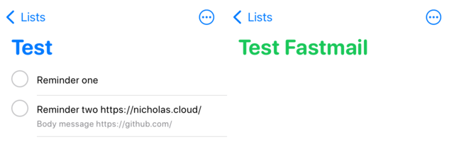
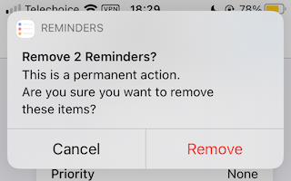
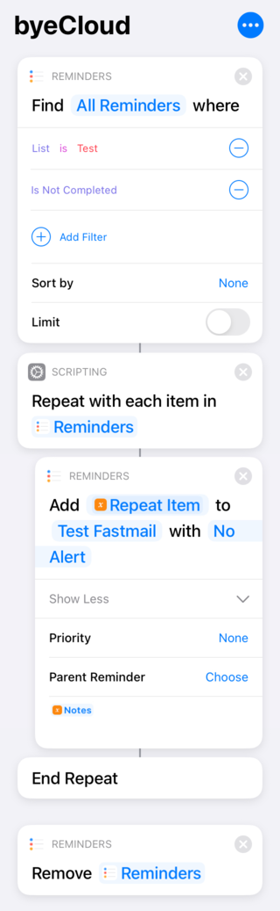

If you've snooped the MX records for this site recently, you might have noticed that I've moved to Fastmail. In addition to email hosting, Fastmail also offers CalDAV accounts for users, so I'm trying it out for my calendar and reminders.

While the Apple ecosystem supports CalDAV accounts, they don't make it easy for you to export your reminders from iCloud into your account of choice. A Reddit post points out that it _is_ possible to copy these reminders across with the Shortcuts app though, so I decided to give that a try. Here's a test run with a simple list of reminders.

There's a few catches with the approach to be aware of, since iCloud reminders have some exclusive (CalDAV-incompatible) features.

-   If the reminder has notes attached, they need to be included in the _Notes_ of the "Create reminder" widget or they won't be copied
-   Some details can't be transferred - namely attached photos, due dates and URLs

When selecting the reminders to migrate, you'll want to filter out completed reminders. When the reminders are created in your new list, they'll be marked as incomplete.

Interestingly, a confirmation prompt shows up when deleting reminders. If you're deleting many at once (I had one list of about ~70 reminders), you'll have to OK it several times before the shortcut proceeds.

Afterwards the shortcut finishes running, all of your reminders will have moved across and you'll be good to go!

Here's the shortcut I wrote, if you'd like to use it.

