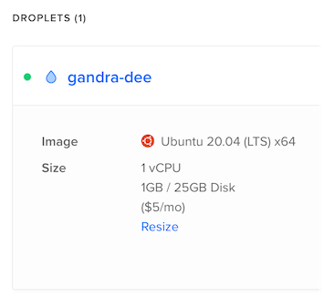

For the last year or so, I've hosted my website using an old Raspberry Pi on my home network. It's served me well, but I'm retiring it for now. I'm sure I'll find a new use for it in the near future though!

I named the machine Cryberry, referencing a brief quip from a streamer I watch. There wasn't any reasoning behind this name choice – I just through it sounded nice, and so I went with it. Thank you for your work, Cryberry.

I'm moving back to the cloud where things are more flexible. I'm still opting for a plain Linux instance, but now it's provisioned with Terraform and managed with Ansible. I'm hoping this will make upgrades/changes a breeze in future, and avoid accident-prone manual work on my part.

As for the instance itself, I'm just going with a small DigitalOcean droplet for now. The real question is, what hostname do I go with for this machine?

This time around, I figured I'd pick a name that means a bit more to me. I've fallen in love with the 2017 reboot of _Ducktales_ in the last year, so I'm naming it after one of the tech-related characters, Gandra Dee.

So now, say hello to `gandra-dee`!

