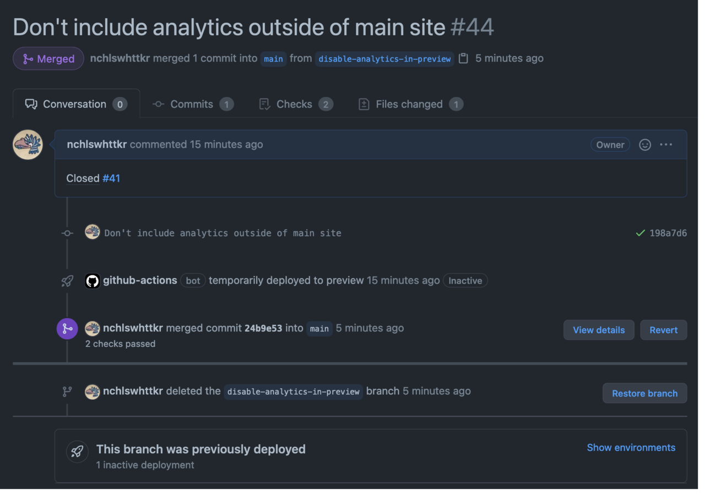

With a little bit of invested time, I've figured out a nice little process for previewing changes to my site. The technical side of it is a writeup for another day, but it's too cool to not to talk about here and now.

I start with my local changes on a new branch, pushing it to GitHub. The response includes a link to create a new pull request.

```sh
git push -u origin HEAD
# remote:
# remote: Create a pull request for 'disable-analytics-in-preview' on GitHub by visiting:
# remote:      https://github.com/nchlswhttkr/website/pull/new/disable-analytics-in-preview
# remote:
# To github.com:nchlswhttkr/website.git
#  * [new branch]      HEAD -> disable-analytics-in-preview
# Branch 'disable-analytics-in-preview' set up to track remote branch 'disable-analytics-in-preview' from 'origin'.
```

The commit message determines the pull request's title. Referencing an open issue in the PR's description makes the two pages reference each other.

PR opened. A workflow I've made with GitHub Actions kicks off, and my changes are deployed to a preview domain. A link to the deployment is included with the pull request.

PR merged. The same workflow kicks off and cleans up the deployed preview, marking it as inactive. The merged branch is deleted. Since the description a reference to "close #41", the corresponding issue is also closed. <sup>1</sup>

It's kinda amazing how much of a breeze previewing is for me now, only ever a pull request away. GitHub's developer experience really shines here too.



<sup>1</sup> Fun fact: GitHub doesn't like it when you [close 100 issues at once with a single pull request](https://github.com/ianstormtaylor/slate/pull/3093#issuecomment-559313932).
