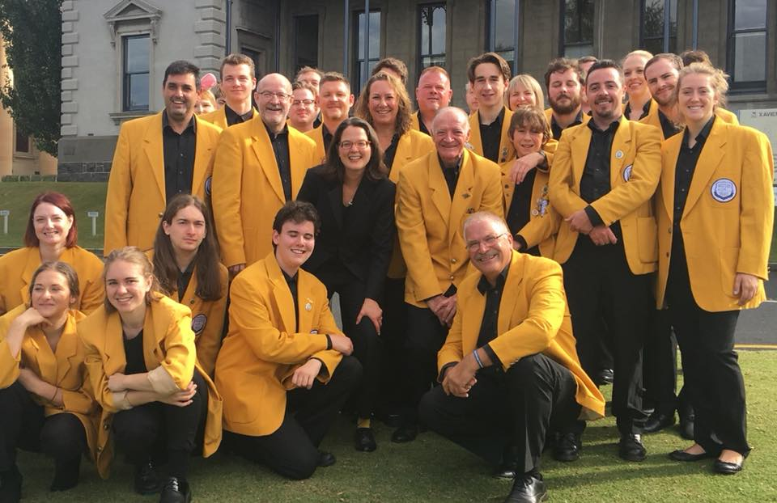
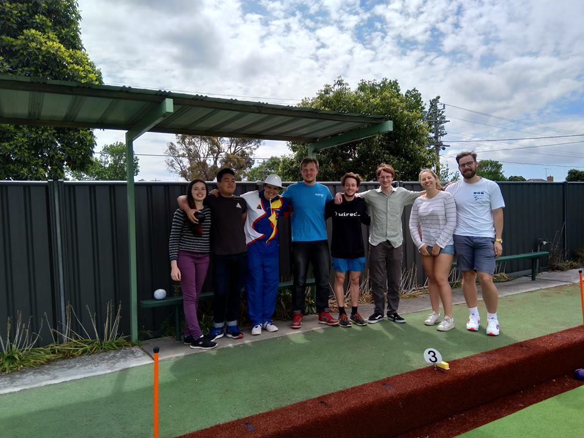

As another year passes by, I think it's time to reflect on the experiences I've had and to look back on some of the highlights as well!

<!--more-->

---

## Music

Music continues to be a strong driving force for me, and the times I spend playing with a band/orchestra are usually the times where I'm enjoying myself most.

### Brass in Bright

Starting off the year, I headed up to Bright for the week-long Bright Brass and Percussion Summer Intensive.

I like being able to drop all of my other commitments for a week solely focus on music. It's where I can focus on building technical skills and on playing. Being out in the regional valleys with delicious meals and local brewery is certainly a plus though.

I'll be back again at the beginning of 2019 for the camp's second year as well. I'm hoping to focus more on building my stamina as a soloist, and trying to keep consistent intonation when playing across varying dynamic levels and ranges.

### Glen Eira Band

The Glen Eira Band has certainly been my favourite to play with this year. We've been joined by Bayside Brass at our rehearsals for quite a while now, since the two bands are both currently experiencing lower memberships. This has allowed us to rehearse with something closer to a full band, and we have regularly manage to have two rows of cornets and a strong bass section at rehearsals.

A new member joined us on trombone this year as well, and this has meant I've been able to focus on playing only uphonium for the band, instead of having to switch parts between gigs. Some members from past years have also returned to play with the band as well.

{}Most Improved Player 2018, Glen Eira Band{}

### Western Brass

With Western Brass, I continued to play euphonium. We managed to place 3rd in our grade at the National Band Championships, and once again competed at states, although this time we placed in the middle of the pack. Not to say I'm disappointed with the result though. I think the band has the ability to win the competition if they can find the dedication to do it.

Currently, I feel the band lacks consistent repertoire, and runs mostly from gig to gig and competition. I believe a greater focus on playing for more community gigs will create a stronger sense of bandsmanship and comradery between members. This would in turn encourage more consistent rehearsal attendance, which the band has lacked this year. I hope to help drive this more in the new year, as I don't think I've done a lot for Western Brass itself in the the past two years I've played with the group.

On the lighter side though, I've convinced a friend to join me at rehearsals on a Tuesday evening, making the journey to and from Footscray much more bearable. I hope this continues in the coming year.

{}3rd of 12 in our grade!{}

### Monash Philharmonic Orchestra

The Monash Philharmonic Orchestra has been fun to play with as well, although my attendance has been lower than I would have liked, the consequence of conflicting schedules. For the first half of this year I was largely absent from rehearsals, due to university classes running into the evening (_Monash has decided that having 3 hour labs until 9pm is acceptable, though I don't agree with this decision_). Between these classes and other work, I was only available for the few weeks immediately prior to the Autumn concert in the first half of the year.

The concert this year that I enjoyed playing most with the MPO was the concerto concert in the middle of the year, despite only playing in a single piece for the concert myself. This was because I had the opportunity to watch my friend perform his own solo (A violin concerto from Winter, of Vivaldi's Four Seasons).

### Glen Eira Youth Orchestra

I feel like this has been a particularly good year for the Glen Eira Youth Orchestra, as we've managed to run our concerts successfully, with our recurring "Winter Showcase" at the Glen Eira Town Hall once again being a hit, and our December concert closing out the year with a ~30 piece orchestra.

Whilst the ensemble still relies on the support of ring-in musicians, I feel confident that our core membership is growing, and that with continued effort we will be able to continue to solidify the ensemble. To do this, I intend to work more proactively on the committee, and try to allocate more time to planning and organising for the group.

I'm also very happy to be playing 2nd trombone as opposed to 1st trombone, mostly because I feel like it encourages the lead trombone to feel more important, and allows me to worry less about needing to lead a section.

{}Glen Eira Youth Orchestra - "Music for Theatre and Film" Concert{}

### Misc Ensembles

I've also been a part of a few other ensembles this year, offering my help when asked. No particular order here.

**Bayside Brass** - Christmas carols along Church Street in Brighton for a few Saturday mornings in December, as well as their street carols in Cheltenham.

**Monash Jazz Orchestra** - 3rd trombone for the "Beyond The Sea" Summer concert.

**Footscray-Yarraville City Band** - Marching for the ANZAC Day Parade and in the opening of an AFL game.

**Hyde Street Youth Band** - Marching for the AFL Grand Final Day Parade.

**Grainger Wind Symphony** - Filling on euphonium for their "Story of Cao Xueqin" concert.

**Bentleigh Uniting Church Band** - Playing euphonium for their annual Christmas service.



---

## Lawn Bowls

### Team/Singles Competitions

I had a good year of lawn bowls. Playing club pennant games on a Saturday afternoon was enjoyable and a good way to step back from the stresses of other commitments. I also had another go at competing in the club minor championships (open to members who have not yet won any club trophies) and managed to win the trophy!

Following on from this, I also signed up for the men's singles championships. Although I didn't come out on top in the end, I'm still proud that I was able to make it to the semi finals, taking games off two strong bowlers from the club along the way.

{}Accepting a prize at the "Charcoal Challenge", a charity bowls day{}

### Social Bowls

Bowls has proven to be a good opportunity to connect with my friends, as the sport is very accessible. I attended a few charity days for Coatesville Bowling Club, including one where I brought along university friends, and this was a very enjoyable experience. After exams in the second semester, I also brought a host of friends from university down for social bowls. I really enjoyed doing this, because it gave me a much needed social opportunity and reprieve from work and university.

I plan to have more days like this in future. Social charity days, such as triples/fours charity days, are great for this.

{}An afternoon of social bowls with James (photographer), Richard, Amelia, myself, Cameron, Lachlan, Patrick, Izzy, and Moss{}

I also now do a few bar shifts for the club now, I find it rather therapeutic.

---

## Work

For the past year I've had the pleasure of working at [Monash University eSolutions](https://www.monash.edu/esolutions), delivering [MonPlan](https://monplan.apps.monash.edu), a course planning application, for students at Monash University.

With the arrival of 2019, I'll be returning to eSolutions under the industry placement program for IT students at Monash University. I hope to use this as an opportunity to take on greater responsibilty within my projects, and to apply what I've learned in the past 12 months.

---

## University

### Studies

Starting my second year at university, I certainly found the level 2 subjects more interesting. These assumed prior knowledge, and were able to cover content in greater depth than the introductory level 1 units I'd previously taken. The units I enjoyed or found particularly interesting were _Operating Systems_, _Theory of Computation_, _Algorithms and Data Structures_, and _Introduction to Databases_.

However, with work running at the same time, I definitely feel like I struggled to attend a satisfactory number of classes and lectures, and in some cases I found I was attending more for the sake of participation marks rather than for my own benefit/knowledge. Previously, I've been able to cruise through most of my classes and miss the occasional lecture/tutorial, but during the last semester of this year, and I hope to remedy this in my (hopefully) final semester of classes next year.

As I [mentioned above](#work), I'll be on a placement at eSolutions for the first half of 2019. Having an educational placement under my current employer should prove interesting. Where possible I'm hoping to shift the focus off the fact that I'm a student, and instead try to be seen as an important asset to the teams I'll be working with.

### WIRED

I served as the marketing officer for [WIRED](https://wired.org.au) this past year, which primarily involving managing social media and sending weekly newsletters. Working with the committee was enjoyable, but I feel like I did not put sufficient effort into fulfilling my role, and that could have had greater input at meetings.

{}MC for Unihack Mini{}

I wasn't elected back to the committee for the coming year, but with a placement running for the first half of the year, it's probably for the better. Since I'll still be heading into Clayton everyday, I can still offer volunteer help. With my involvement being voluntary now, I think that will also help my reduce my heavy workload.

---

## Dev

### Juniordev / LevelsConf

I took the time this year to attend a few developer-focused events when I had the time free. This included some meetups for [Juniordev](https://juniordev.io), and the tech conference they later ran, [LevelsConf](https://twitter.com/levelsconf). These were both fun as well as a good learning experience, and I enjoyed the company of friends and free food where it was available. Unfortunately, I'm not usually able to attend these events because of my music rehearsal commitments. If I'm able to find the time, I'll consider attending more in the coming year.

### Hackathons

I've begun to feel like hackathons aren't the type of event for me, but nonetheless I endavoured to attend a few throughout the year. This started off with the Facebook Regional Hack in May, [Unihack](https://unihack.net/) in July and [GovHack](https://www.govhack.org/) in September. I was also involved with running Unihack Mini as a part of WIRED, though I didn't participate myself.

You can also read more about the Facebook Hack in my [reflection post](/blog/facebook-hack-2018).



{}Shoutout to my team from GovHack!{}

These events were fun, though I feel that I'm usually going moreso to enjoy the weekend hanging out with friends rather than to seriously compete. I'm still deciding how involved I want to be next year, but if I'm going to commit to a hackathon going forward, it would serve me better to dedicate my time and effort to only one or two events. At events this year, all productivity/useful output from me usually ceased in the evening of the first night, and I would end up heading home or lounging about, contributing very little for my team. I want to curb this going forward.

### Personal Projects

I never really found the time to work on a personal project this year, or at least anything substantial. I've certainly been learning, whether it be in terms of development knowledge or professional skills.. Hopefully I'll be able to make something come to fruition in the coming months to showcase what I've picked up.

### Seasonal Events

I did [Hacktoberfest](https://hacktoberfest.digitalocean.com) again this year, getting involved in open source development. Most of my contributions are usually trivial, but I endavour to make at least one beneficial contribution each time.

Last year, I added a [blacklist to filter unimportant item usage stats](https://github.com/odota/web/pull/1286) in a match analysis service for DOTA2. This year, I ended up writing a new feature for a tool written by Microsoft for consolidating multiple JavaScript projects into a single location. With this incorporated and released, you can now [include Git hooks with a your project](https://github.com/Microsoft/web-build-tools/pull/916)!

This December, I've also been doing the [Advent of Code](https://adventofcode.com) challenge, though with work, university and music still running, I'm a little bit behind. I'll see where I end up at the end of the year.

---

## Misc

### Gaming

I bought a Switch, it was worth it. I've sunk at least 100 hours into Breath of the Wild since picking it up, and other games (Super Mario Odyssey, Owlboy) have been great fun as well.



### Comics

I first developed an interest in comics back on a music tour to America with my high school jazz band in 2013, and I've been reading ever since.

Sadly though, the comic book shop I've been with for the past 5 years, Classic Comics, announced that they intend to close down at the end of the year. It's a shame to see them go.

The series I've been following this year have Mister Miracle and Wayward, both of which came to a conclusion in the past few months. Outside of this, I've managed to get my hands on all the volumes of Saga, and I'm hoping to get through reading all of them some time in the new year break.

{}Wayward and Mister Miracle, from my collection of comics{}

---

## Looking Forward

Next year I'm setting and hoping to keep a few resolutions.

-   **Abiding by a more consistent sleep schedule** to help avoid the feeling of fatigue that can sometimes plague me during the day.

-   **Effectively managing my time commitments** to give myself more freedom to do what I want with my time, and to ensure I don't end up feeling burnt out.

-   **Ensuring I don't miss breakfast**, because this year I've had too many mornings where I've dashed out the door without a proper meal.

<strong>Here's to 2019!</strong>

---


