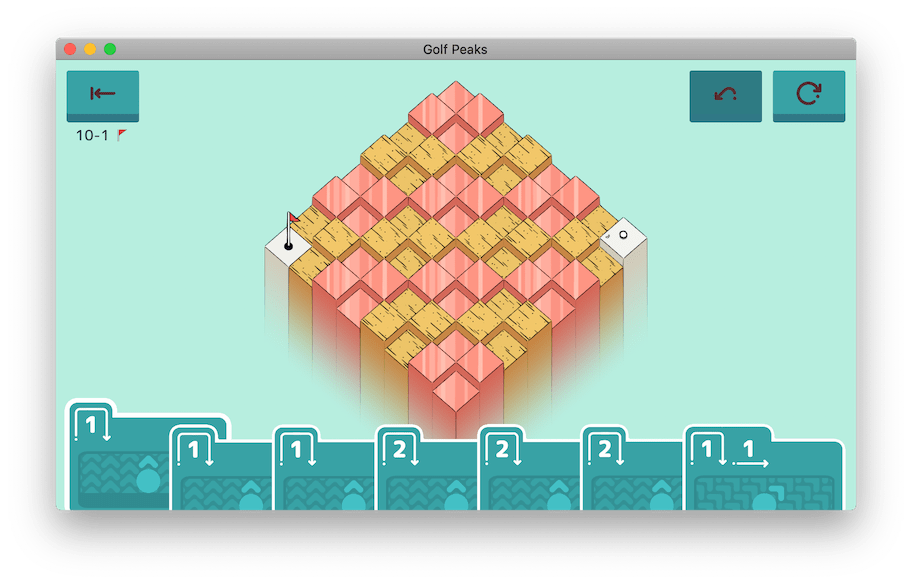

> _"Well here we are again, it's always such a pleasure"_

Over the past few weeks, I've been building a solver for the [puzzle game Golf Peaks](https://afterburn.itch.io/golf-peaks) and improving its performance over the course of a few blog posts. Given I've still got a few final ideas I'd like to try, how about one last writeup?

<!--more-->

The key issue remaining with the solver is that it still treats every card in the player's hand as _unique_. In levels with many duplicate cards, the solver needlessly tries each of them hoping to find a better solution. I landed on [two different approaches](/blog/speeding-up-a-solver-for-golf-peaks/#can-we-go-even-faster) to resolve this.

It should be noted that in fixing this, our algorithm loses sight of how cards are ordered in the player's hand. In turn, this affects how we generate AppleScript instructions to solve a level. We'll need to scan the player's hand after each move to find where the next card is. As we'll see though, this tradeoff is worth the improvement in solving time.

## Counting cards

Instead of accepting a set of cards, our algorithm can just as easily work on a set of _unique_ cards with counters for type of card. It will only need to try one of each available card type at each recurse, decrementing the appropriate counter as it "uses" a card.

So, how much of an improvment do we see when we [stop trying duplicate cards](https://github.com/nchlswhttkr/golf-peaks/commit/e3b1f95159c3832b07d07d8ba96ec7b0aa0580fb#diff-639fbc4ef05b315af92b4d836c31b023)?

```sh
./benchmark-solver.sh > benchmarks/solver-benchmark-08.csv
python3 stats.py < benchmarks/solver-benchmark-08.csv
# Ran 100 iterations
# Took 0.198s per iteration
# Solving all levels took 3129 steps
```

Racing along! In fact, the longest we're spending on any level now is down to 17ms! The previously problematic level `08-08`, where we had eight copies of a same card, is solved near-instantly now.

In terms of time, there are only three levels remaining that take 10ms or more to solve.


To me, nothing in these levels stands out as particularly problematic. They're just challenging levels.

-   The player has quite a few cards of different types in their hand.
-   There's many long paths to take through the level that don't reach the hole.
-   Every card needs to be used to complete the level, no shortcuts!

The fact that we're now faster than we've ever been is great, but there's still one approach to try!

## Pathfinding through a graph

From the beginning, I've been toying with the idea of rewriting the solver to employ a graph-based algorithm. However, Golf Peaks has a catch in that pathfinding is multi-faceted. While we need to find the fastest solutions (fewest steps), we're constrained by the cards in the player's hand too.

It takes a bit of effort, but the solver can be rewritten to use a [pathfinding algorithm](https://github.com/nchlswhttkr/golf-peaks/commit/9f2ed1ac4c7d3f9e55fb10c53462ba94574c567d). The question is, how does it compare?

```sh
cargo build -q --release
time bash -c '
ls -1 /tmp/levels | while read LEVEL; do
    ./target/release/golf-peaks --steps < /tmp/levels/$LEVEL > /dev/null
done
'
# real    0m10.711s
# user    0m9.204s
# sys     0m1.286s
```

Not as fast as we once were, but that's to be expected. To validate paths, we need to keep a history of the moves performed. While we were able to push and pop from this history in a depth-first search as we recursed, this graph-based approach is _iterative_. Branching paths have to keep their own _separate histories_, and making the necessary deep copies is expensive.

Let's try running it again, but with the algorithm terminating after it's computed every available move, rather than continuing on to find a path. This gives us a rough ceiling on how fast our solver can get.

```sh
cargo build -q --release
time bash -c '
ls -1 /tmp/levels | while read LEVEL; do
    ./target/release/golf-peaks --steps < /tmp/levels/$LEVEL > /dev/null
done
'
# real    0m0.871s
# user    0m0.142s
# sys     0m0.114s
```

Doing this move computation _alone_ is costly, but integral to building our graph. Considering how long a complete run with the current solver takes (at 0.2s), it's unlikely we'll be able to beat it with this algoritm.

Another issue with this algorithm is how it uses a `HashMap` to store and list tiles placed around the map. When iterating Rust's `HashMap`, key-value pairs are yielded in an _arbitrary order_. This can result in the solver finding different (perfectly valid) solutions between runs. This kind of inconsistency is a barrier for testing, and working around it usually introduces further, undesirable complexity.

It's worth noting that this graph-based approach does excel in other areas, even if it's not ideal here. By computing every possible move in a level, it's very easy to find the path between _any_ pair of nodes in the graph. If we wanted to choose the best starting position from a set of options, this graph-based approach would blow a depth-first search out of the water!

Although this alternative pathfinding method didn't work out, it's still been good to try it. We're still faster than we were before regardless.

## Is this the end?

Yes it is, I think I'm finally ready to shelve this work. I'm happy to have taken the benchmark from 10 seconds down to only a handful of seconds, and without any drastic changes along the way!

I'm certain there are still many ways to speed up the code I've written, but the specifics are beyond me for now. You _could_ rewrite the Python parser in a language that takes less time to initialise, but I don't see that as a meaningful improvement. To me, this project has been an exercise in understanding how my programs are behaving beneath the surface of the code I've written, and trying to improve them from there.

Truth is, the fastest way to beat Golf Peaks is to just _play it yourself_, not to spend weeks building and iterating on a solver for it! That said, those weeks have been just as enjoyable for me. Much like figuring out a tricky level was a rush, so to have been the feelings from untangling troublesome bugs and beating my previous benchmarks!

For one final hurrah though, let's run the solver in _parallel_ once more and see how long it takes to finish. We weren't quite able to do it in under a second previously, but perhaps today's change has pushed us over the line?

```sh
time bash -c '
cut -d "," -f 2 levels.txt | while read ASSET; do
    echo "/usr/local/bin/python3.8 parse.py < gp_levels/$ASSET.asset | ./target/release/golf-peaks > /dev/null || echo FAILED $ASSET"
done | xargs -P 8 -I "{}" /bin/bash -c "{}"
'
# real    0m0.690s
# user    0m3.141s
# sys     0m1.554s
```

Blink for a second and you'll miss it! That's all folks!

## Considerations

As I wrap up, there's a few last things I'd like to mention, both about this project and more generally about software development.

When refactoring, tests are fantastic for instilling confidence and preventing you from unknowingly breaking something. Much like a safety harness, their presence is always comforting. It's also fine for the way you test to vary depending on circumstances. Sometimes you need to check the output of an entire program, sometimes you only need to check the ouput of a single function.

It's always good to understand your requirements and constraints, even if they might be self-imposed on a project like this. I always had my parser reading level files before feeding them into the solver, but I could have easily stored the results after the first run to save myself time. This is even what we did when benchmarking! I kept this out of full runs though, because I wanted to keep the complete solving process in scope, from parsing level files to issuing keystrokes in-game.

Lastly, it's worth remembering that _many optimisations are situational_. Tactics like memoization trade memory for computation time. Simple sorting algorithms can outperform their counterparts on real world data. Speeding up your system may [take a counter-intuitive approach](https://blog.cloudflare.com/why-we-started-putting-unpopular-assets-in-memory/) at times. It's important to observe your own data and behaviour to understand how you should improve, because there's rarely a one-size-fits-all solution.



{}In level `10-01`, the ball only ever needs to be hit in a northwest direction to solve it!{}

If we took away the solver's concept of "south" and "east" here so it only knew how to go up and left, this level would be a near-instant solve. Try and apply this improvement to other levels in the game though, and you'll have a bad time.

To repeat something I've said before, _solutions are dictated by their requirements and constraints_. I think this is part of what makes software development so interesting, with new problems and challenges to tackle at every turn.

As always, thanks for reading! I can't help but recommend [Golf Peaks](https://afterburn.itch.io/golf-peaks) one more time if you're looking to put your putting and puzzling skills to the test! If you're interested in checking out the code, analysis and results behind this project, you can find it all on [GitHub](https://github.com/nchlswhttkr/golf-peaks/) too.

---

PS - Shoutout to ImageMagick for helping me knit level screenshots together!

```sh
magick 09-12.png 10-01.png +append /tmp/levels-top-row.png
magick /tmp/levels-top-row.png 07-06.png -gravity center -background none -append levels.png
```
