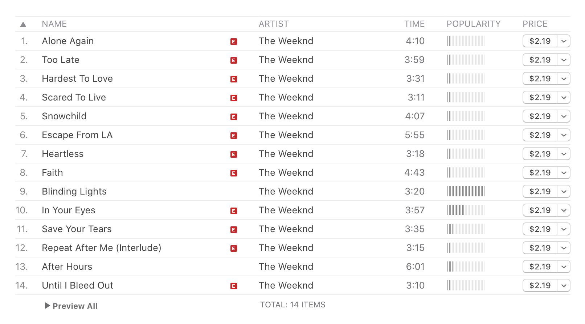

There's a lot of ways to listen to music in this day and age. You might see it live, streamed over the internet or played from a vinyl record. Today though, I want to advocate for a particular approach to listening to recordings.

Take an album and let it run from its first track until conclusion. Don't put it on shuffle. Don't only play the most popular tracks. Listen to everything the album has to offer, in the order in the order that it's listed.

<!--more-->

## What you gain from listening linearly

_"Listening Linearly" would have been a good title for this post. Ah well, c'est la vie._

Much like a book or a movie, I think a lot of albums have an inherent narrative to them. Tension can build and release over the course of songs, and the music can reach a dramatic climax or come to triumphant resulution. If you jump around and skip over pieces, all of that magic is lost.

You can't listen to "Dollar Days" and "I Can't Give Everything Away" in isolation and take nearly as much as much away from them if they aren't bookending _Blackstar_. It's not the same if they aren't following on from the distorted effects and frantic saxaphone solos that came earlier. This is all before even contextualising the album with Bowie's battle against cancer and his passing.



There's brief moments of joy you get when you listen to albums uninterrupted too, courtesy of a little musical device called a segue. I think it's captivating when one song flows into the next in an album. Take the closing tracks in Gorillaz's _Demon Days_, "Don't Get Lost In Heaven" and "Demon Days", as an example. Personally I consider them to be a single piece, given how they fade together.

## Perhaps it's not the style of today

I think this style of listening stems back to the days of vinyl records, where jumping easily between tracks wasn't a possibility. It was just needle down, from start to finish. An album like _The Dark Side of the Moon_ only ever lets up when you need to flip from side A to side B.

_Funny to think I'm not a vinyl person given my inclinations._

That's less the case in the age of streaming. Spotify and Apple Music push their "Discover" playlists and direct you to hear the "Top Hits", with single snippets from trending artists and musicians you might like. YouTube sends you to music they believe is "Recommended for you" with autoplay. While the smorgasboard can be nice, you're missing out on the opportunity to further explore individual artists and what they offer.

{}A "popularity" measure draws focus to a subset of tracks, and away from the album as a whole.{}

I'm sure there are some artists who just treat albums as a means to group and release their music, just putting the latest collection of recordings into a format that's easier to release and sell. Despite all this, I'd confidently say that music albums as a form of expression are alive and well. You just have to look in the right places.

Where can you see this? Video games.

These days, a lot of games will market their soundtrack just like they market their game. It's especially common with games from independent studios. You just know that somewhere on the landing page you're almost certain to find a link to the composer's Bandcamp.

It fits well too. Music is often complementary to gameplay, if not an integral device tied to the storytelling and narrative itself. It seeps its way subconsciously into memory, so much so that you might hear an iconic theme from an overworld or boss and feel the same rush of emotions you felt years ago.

If you've played a game like [Celeste](http://www.celestegame.com/) or [Hollow Knight](https://www.hollowknight.com/), I'm sure you'd be able to pick up all the story beats of Madeline and the Knight from their respective soundtracks. Musical themes and elements flow just as the story does, and it all ends up bundled into an album for you to listen to.

So why not relive it all with headphones instead of a controller?

## It's just food for thought

All of this said, I don't want to decry playlists and curated mixes. The models behind them are just as applicable to helping me find [new sounds I might like](https://www.music-map.com/vulfpeck) as they are to helping other explore songs that fit their tastes.

On some level too, albums are just constrained playlists. You don't get the flexibility to curate music from anywhere or anyone to share and enjoy. You get what you're given and that's that.

It also doesn't mean you have to _like_ every part of an album. I know I've certainly got albums where I'll jump over tracks to get back to the good bits.

To me, an album is a vehicle to creating a bigger picture with music. They can make something greater than what individual songs might be able accomplish. It's easy to miss that beauty sometimes. So, the next time you're looking for an hour of music to fill your day, try the "Albums" tab instead of "Playlists".
