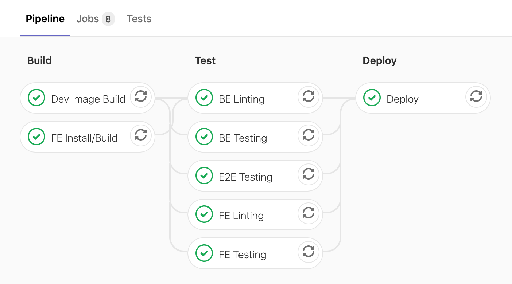
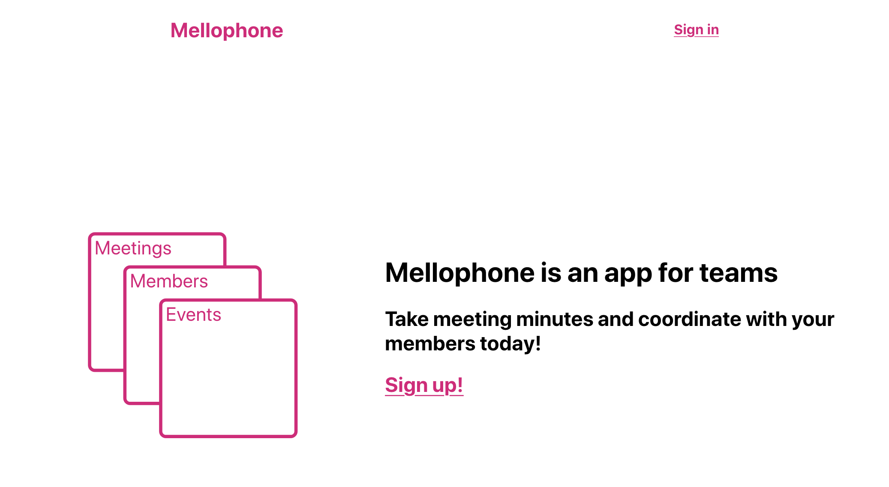

Just shy of two years ago (judging by the initial commit on a private repo), I started a little project called [Mellophone](https://github.com/nchlswhttkr/mellophone).

It was a pet project to consolidate what I'd learned from working as a developer.

The domain registration for `mellophone.pink` expires tomorrow, and I won't be renewing it.

As a little farewell, I figured this would be a good opportunity to delve into some of the workings behind it.

<!--more-->

As a service, Mellophone was a tool for taking meeting minutes, being able to share them easily via the web.

It was initially called Soprano, but someone took `soprano.app` before me.

So without further ado, let's dive into what made up Mellophone!

### A consistent and reproducible development environment

One of the main pain points with development across devices is the dreaded "works on my machine" situation. I set out from the start with the intent to avoid this as best I could.

I taught myself Docker and managed to get the backend server and database working together with Docker Compose. This effort paid itself back immediately when the database adapter refused to work on macOS, citing an outdated (though technically not deprecated) version of OpenSSL.

Chuck it all in an Ubuntu container and problems like that are toast! Was it worth the performance/productivity drop that comes from working with containers? That's a debate for another day.

I deliberate wrote the Django server configuration with **production-first** options in mind. If I encountered problems locally, I would fix them in a local-only config. To this day, the [production settings](https://github.com/nchlswhttkr/mellophone/blob/master/mellophone/mellophone/settings_production.py) are no different from the defaults!

When it came to frontend development, it was a blessing that [Create React App](https://create-react-app.dev) had already done the hard yards to create a reproducible working environment.

My only addition for frontend development was to proxy network requests to the locally running backend server. Given the containers could be brought up with only a few commands, it was a better to work with them rather than maintain mock responses.

### Staged CI with GitLab

I went with [GitLab](https://gitlab.com) to automate testing and deployment for Mellophone, as they made it easy to split a build into many separate jobs.

While my project was hosted on GitHub, GitLab's repository mirroring meant I didn't have to worry about keeping the two remotes in sync.

Another particularly nice feature was the jobs could be run concurrently by grouping them into stages. In the case of Mellophone, I ended up with 3 stages:

1. **Build** the development Docker image and a production-ready version of the frontend
1. Run **tests** at various levels of the application (unit tests, E2E tests)
1. **Deploy** to production for pushes to `master`

Jobs within a stage could run concurrently, while each stage would run linearly.

Having single-purpose jobs made it easier to identify _what_ was breaking a build. Being able to run these jobs in parallel helped keep the build fast though!

As a word of warning, be careful when using caching to speed up your builds! I had a [fun evening debugging](https://github.com/nchlswhttkr/mellophone/commit/68df093cf96fcc0f5560db3729656f03bd747923) when a hidden dependency lurking in cache caused jobs to start failing when the cache was cleared!

### Managing a Linux server, running updates and migrating

Setting up my project on a hosted server was a lot of fun, especially with the help of [DigitalOcean's tutorials](https://www.digitalocean.com/community/tutorials/how-to-set-up-django-with-postgres-nginx-and-gunicorn-on-ubuntu-18-04). It's an interesting experience to work with a remote host that you only have SSH access too.

I was able to automate upgrades to production with the help of [systemd](https://github.com/systemd/systemd). With an hourly timer to check for a new deployment, I could temporarily bring down the web server and run any necessary updates. By running this final stage of a deployment on the host itself, I didn't have to worry about letting the SSH connection from GitLab CI run commands as a superuser!

At one point, I started up a new DigitalOcean droplet and moved Mellophone over to that. Aside from recreating the working environment on a new host, I was able to dump the database and recreate it in the new instance. Better yet, I accomplished this with no downtime, switching traffic over to my new droplet before turning off the old droplet!

An important lesson here is that if the setup for your project is significant enough, it should probably be captured under version control. That might be a Dockerfile or a CloudFormation template, but even a [rough set of commands](https://github.com/nchlswhttkr/mellophone/blob/master/scripts/set-up-mellophone.sh) is still helpful.

### Different forms of testing

Testing is something I've grown to love, and watching a test suite run and finish successfully is always satisfying.

I had unit tests for the backend to making sure edge cases/requirements were being handled before writing to the database.

On the frontend I could test React components to make sure they behaved as expected, and could test they all worked together on various pages as users navigated around the app.

I even managed to get end-to-end tests running in headlessly in GitLab, giving me more confidence that everything would like work together in production!

A particularly interesting element of the frontend tests was the `TestRenderer` wrapper I wrote to help [mock dependencies during testing](https://github.com/nchlswhttkr/mellophone/blob/master/mellophone/frontend/src/utils/TestRenderer.tsx). While it allowed me selectively overwrite data-fetching functions and application state, it still ended up feeling a little clunky to use. In future projects, I'll probably stick to passing in mock props, unless I can justify the benefits of implementing a solution which isn't as a straightforward and predictable. Implementing more complex solutions like this did allow me to explore React's Content API though and gave me more opportunities to learn.

In general, a key lesson from writing all of these tests was that the more you can do to make a test easy to debug, the better. This can be as simple as adding [warnings for common issues](https://github.com/nchlswhttkr/mellophone/blob/master/mellophone/frontend/src/setupTests.js#L4), to including [additional output during tests](https://github.com/nchlswhttkr/mellophone/blob/master/mellophone/e2e.py#L40) to help diagnose the cause of a problem in future.

### Pretty snippets and cool things

There were a few times during this project where I looked at a piece of code and thought that it was particularly nice or interesting.

For example, I wrote a function to [map routes and methods to a relevant handler](https://github.com/nchlswhttkr/mellophone/blob/master/mellophone/backend/urls.py#L27), since Django seemed to only allow one handler per route. It could also catch exceptions and return the appropriate error response.

In the frontend, I had a higher-order component to [enforce authentication on a per-page basis](https://github.com/nchlswhttkr/mellophone/blob/master/mellophone/frontend/src/utils/requireAuthentication.tsx) and show a fallback if provided. There are cleaner patterns for managing this (like having a different set of routes loaded depending on whether a user is authenticated or not), but I like this approach nonetheless! Admittedly, I think I spent more time fixing errors between TypeScript and Reach Router than I did actually writing this function.

I originally used MobX for state management, but ended up switching back to Redux as it made testing state and state changes much more predictable. I didn't need the benefits of MobX's observer-based architecture, so going to a Flux-based wasn't a loss. If you're considering using Redux, seriously consider the [re-ducks](https://github.com/erikras/ducks-modular-redux) pattern to help keep your modules tidy though!

Lastly, to give an explicit mention to the other cool things behind Mellophone:

-   [React Testing Library](https://github.com/testing-library/react-testing-library) and the testing patterns espoused by [Kent C Dodds](https://kentcdodds.com)
-   [Rsync](https://rsync.samba.org/), a tool so great I've already [written about it](../a-pretty-little-bit-of-rsync/)!
-   [Nginx](https://nginx.org/en/) for making it easy for me to serve static files and reverse proxy requests to my Django server
-   Just plain Git, making it possible for me to working on multiple features simultaneously

### The chopping block

Some features never made it to production, but they're still worth mentioning!

**Granular permissions** would have helped give greater control over what members in a team could do. For example, semi-important members might be able to `write_meetings`, but not `edit_members`. It's a bit more flexible than role-based permissions, like `admin`, `committee`, `member`.

**Automatic PDFs of meetings** would have been very convenient, especially when many organisations keep versioned documents. While the database might hold a _current_ representation of a meeting, _past snapshots_ could exist as static PDF files. I actually made a [small script](https://gist.github.com/nchlswhttkr/f0cec08eedb4d8482ef92829a9a5c1b9) that accomplishes something similar to this, taking a folder of images and assembling it into a PDF for me to read on an scan of a comic.

### Farewell Mellophone

So that's about it. I had good run with Mellophone, but now it's time to say goodbye.

At the end of the day perhaps I didn't write the most amazing code, but I everything I wrote I'm proud of nonetheless.

Goodbye Mellophone.

