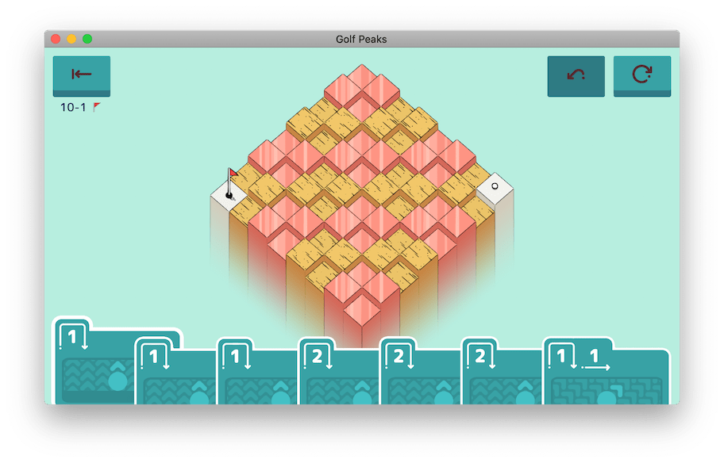
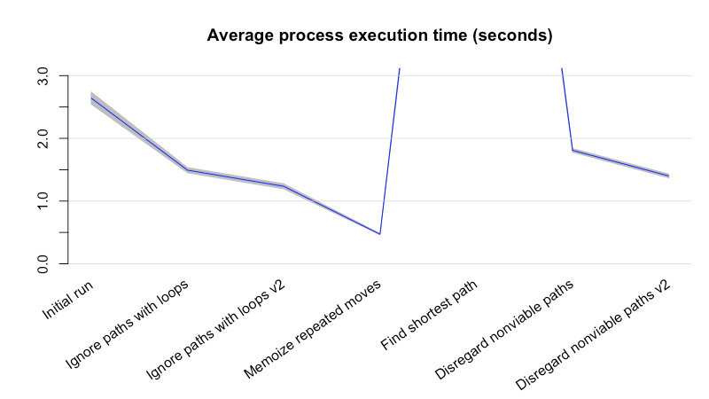
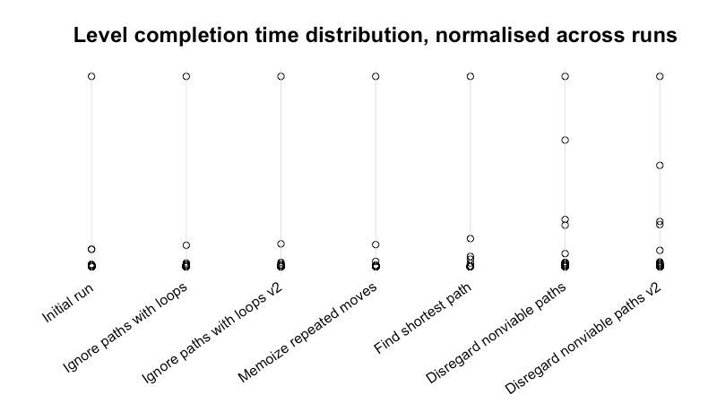
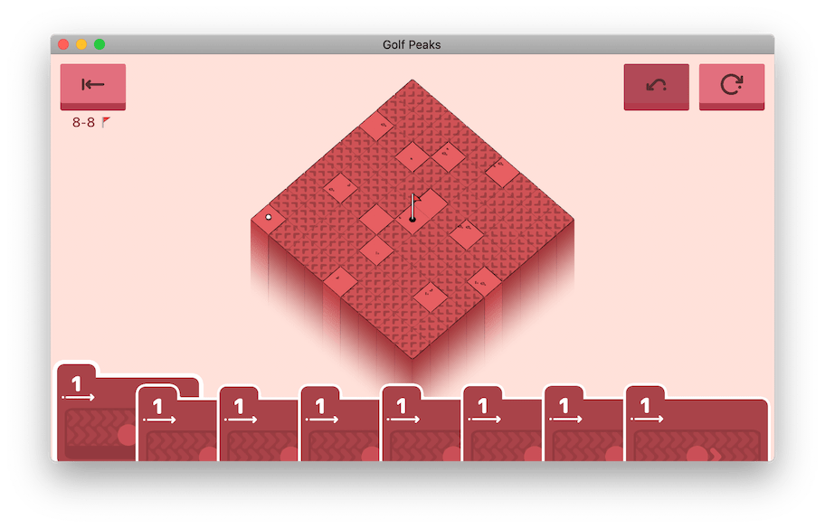

Previously, I wrote about a solver I'd built for the puzzle game [Golf Peaks](https://afterburn.itch.io/golf-peaks). In closing, I had a few ideas on how it could be sped up and improved. Over the last few days, I've been trying some of these ideas out, and measuring the results!

<!--more-->

I will warn that this blog post is _long_. If you'd like to read across a few sittings, you can navigate to different sections from here!

-   [A foreword before continuing](#a-foreword-before-continuing)
-   [The current project state](#the-current-project-state)
-   [Speeding up the level parser](#speeding-up-the-level-parser)
-   [Speeding up the solver](#speeding-up-the-solver)
-   [The end result](#the-end-result)
-   [What does a run look like now?](#what-does-a-run-look-like-now)
-   [Can we go even faster?](#can-we-go-even-faster)
-   [Congratulations, you made it to the end!](#congratulations-you-made-it-to-the-end)

## A foreword before continuing

Before we jump in to the nitty-gritty, there's a few things to cover.

I've been making improvements to this project with small, iterative changes. When I've tried something new, I've included the commit so you can see the changes involved.

You'll see bash loops quite a bit throughout here, since testing involves running a command for every level in the game. The key area to focus on in these code blocks is the command being run _inside_ the loop. The loop logic usually just feeds the right file to the right command.

```sh
# Don't pay too much attention to these loops
ls -1 gp_levels | while read LEVEL; do

    # Focus on the command being run inside the loop!
    wc -l gp_levels/$LEVEL

done
```

For benchmkaring, I use the inbuilt `time` command of bash. It records several metrics on how long a given process ran for.

-   The time elapsed between a process starting and exiting is the _real_ time.
-   The amount of time spent by a process running in user mode is the _user_ time.
-   The amount of time spent by the kernel running code on behalf of our process is the _system_ time.

If terms like user mode and kernel mode aren't familiar to you, don't worry! Just know that we can get a good measure for how long our solver spent running on the CPU by _adding the user time and system time_.

Finally, these measurements _aren't exact_. Long-running commands end up with a fair amount of variance in their runtime. Simple levels are solved near-instantaneously, but the granularity of our measurements is limited to milliseconds.

With that out of the way, let's go and make this solver fast!

## The current project state

From the outset, we know the solver can absolutely be faster. It takes a noticeable few seconds to solve some late-game levels. The main culprit is level `10-01`, referred to as `ten_4.asset` in the game's files. This level has many long paths the solver wastes time exhausting.



{}With so many moves and potential paths, the solver has a lot to consider.{}

Let's see how long it takes to to find a solution on this level.

```sh
time bash -c "python3 parse.py | cargo run -q --release -- --steps" < gp_levels/ten_4.asset > /dev/null

# real    0m1.975s
# user    0m1.963s
# sys     0m0.026s
```

Most levels are solved in a matter of milliseconds, but this particularly daunting level takes well over a second!

Let's dive in and try to find some ways to improve this.

To start, it's good to get a measure of how long the solver takes _overall_. Let's run it against every level in the game.

```sh
time bash -c '
cut -d "," -f 2 levels.txt | while read ASSET; do

    python3 parse.py < gp_levels/$ASSET.asset | cargo run -q --release > /dev/null

done
'

# real    0m9.598s
# user    0m9.278s
# sys     0m2.071s
```

There's 120 level files that need to be parsed and solved here, so taking around 10 seconds isn't _too_ bad. It leaves plenty of room for improvement though!

Solving a level takes two components, each their own program.

-   A Python program that parses a level's details from its asset file
-   A Rust program that reads in a level and returns a solution if one exists

It's best to evaluate these programs individually.

## Speeding up the level parser

Let's start with the parser. It's reads in the YAML asset file for a level and converts it into the format expected by the solver. How long does it take to parse a level? How long does it take to process all levels?

```sh
# Time solving level 01-01
time python3 parse.py < gp_levels/roll_1.asset > /dev/null
# real    0m0.059s
# user    0m0.046s
# sys     0m0.010s


# Time solving every level (including unused/unreleased ones)
time bash -c '
ls -1 gp_levels | while read ASSET; do
    python3 parse.py < gp_levels/$ASSET > /dev/null
done
'
# real    0m7.584s
# user    0m5.903s
# sys     0m1.172
```

Spending a few hundredths of a second parsing a level is fine when you've only got a couple of levels to cover. However, this small cost scales linearly the more levels we need to solve. Each time the command runs, the interpreter needs to start up, read the script file, and load the necessary modules. Doing this again and again adds up, taking a considerable amount of time.

The work the parser needs to do outside of parsing the YAML is fairly simple; It just reads and translates the `Level` and `Cards` fields, both of which are plain strings. If we dropped PyYAML and did the work of extracting these fields ourselves, would we save much time?

Let's try running a very simple (empty) program to get an idea of how much time we'd save.

```sh
time bash -c '
ls -1 gp_levels | while read ASSET; do
    python3 -c "pass" < gp_levels/$ASSET > /dev/null
done
'
# real    0m4.074s
# user    0m2.706s
# sys     0m0.912s
```

It looks like we might see some improvements from implementing the YAML loader ourselves. As a safety measure, let's save a copy of the parsed level files now to test against later. So long as the output at the end remains the same, we'll know we haven't missed anything!

```sh
# Process every asset file with the existing parser
mkdir -p /tmp/parsed-levels-test
ls -1 gp_levels | while read ASSET; do
    python3 parse.py < gp_levels/$ASSET > /tmp/parsed-levels-test/$ASSET
done

# Confirm that all 134 asset files were parsed
ls -1 /tmp/parsed-levels-test | wc -l
# 134
```

With that out the way, we can [rewrite the parser and remove PyYAML](https://github.com/nchlswhttkr/golf-peaks/commit/c123a331223515e1924f5b7112e44411f3ac21ed#diff-100a58ba22639ca4942d0ea33f1060da). To confirm that we're still parsing levels correctly, we can `diff` the result against our test output.

```sh
# Process every asset file with the new parser
mkdir -p /tmp/parsed-levels-new
ls -1 gp_levels | while read ASSET; do
    python3 parse.py < gp_levels/$ASSET > /tmp/parsed-levels-new/$ASSET
done

# Confirm that there are no differences between the two outputs
diff --new-file /tmp/parsed-levels-test /tmp/parsed-levels-new | wc -l
# 0
```

It works! The question is, will it be faster now?

```sh
time bash -c '
ls -1 gp_levels | while read ASSET; do
    python3 parse.py < gp_levels/$ASSET > /dev/null
done
'
# real    0m4.177s
# user    0m2.820s
# sys     0m0.913s
```

Hooray, we've cut our runtime roughly in half!

Now, Python comes installed by default on many systems. While this is convenient for general development, it does make it very easy for your installation to lag behind the latest releases. Let's take a look at my environment for example. I've got quite a few versions of Python 3 installed.

```sh
python3 -V
# Python 3.6.8

/usr/bin/python3 -V
# Python 3.7.3

/usr/local/bin/python3.7 -V
# Python 3.7.9

/usr/local/bin/python3.8 -V
# Python 3.8.5

# This is why we need to use virtualenv...
```

When I'm running `python3` in these tests, my shell is finding Python `3.6.8`. Compared with later releases, I'm missing out on optimisations that could potentially speed up my runtime! Let's try measuring our speed again, only this time with the current latest release, `3.8.5`.

```sh
time bash -c '
ls -1 gp_levels | while read ASSET; do
    /usr/local/bin/python3.8 parse.py < gp_levels/$ASSET > /dev/null
done
'
# real    0m2.765s
# user    0m1.760s
# sys     0m0.746s
```

Thanks to work by Python's maintainers on the interpreter, parsing all the levels now takes significantly less time! The only effort on our behalf was in keeping up to date.

Time to move onto the solver. Before we begin, let's save a parsed copy of 120 playable levels in Golf Peaks. This saves us parsing the level each time we want to run our solver.

```sh
mkdir -p /tmp/levels

cut -d ',' -f 1 levels.txt | while read LEVEL; do
    ASSET=$(grep -m 1 $LEVEL levels.txt | cut -d ',' -f 2)
    /usr/local/bin/python3 parse.py < gp_levels/$ASSET.asset > /tmp/levels/$LEVEL.level.txt
done
```

## Speeding up the solver

Time to jump into the solver itself! As a first check like we did with the parser, how long does it take to solve all 120 levels?

```sh
time bash -c '
ls -1 /tmp/levels/* | while read LEVEL; do
    cargo run -q --release -- --steps < $LEVEL > /dev/null
done
'
# real    0m5.164s
# user    0m3.794s
# sys     0m0.872s
```

Not the best, but that's what we're here to improve!

Right off the bat, there's a quick change we can make. Although `cargo run` makes it easy to compile and run our code, it isn't needed when we're running the same unchanged code repeatedly. Not only is this faster, but it prevents the Rust toolchain from interfering with our measurements.

```sh
# Build the release binary beforehand
cargo build -q --release

# Repeat our previous test without calling cargo
time bash -c '
ls -1 /tmp/levels/* | while read LEVEL; do
    ./target/release/golf-peaks --steps < $LEVEL > /dev/null
done
'
# real    0m2.848s
# user    0m2.640s
# sys     0m0.130s
```

Now to do some proper benchmarking. I've written the [`benchmark-solver.sh`](https://github.com/nchlswhttkr/golf-peaks/blob/main/benchmark-solver.sh) script for this. It runs the solver across all 120 levels repeatedly, using `time` to measure how long it takes to read a level and return a solution. Once the script finishes, it produces a CSV which we can use for analysis later.

With benchmarking ready to go, let's try it on the [existing solver code](https://github.com/nchlswhttkr/golf-peaks/blob/56f29a68cc28bc137a30d562915c21f85f6d8041/src/main.rs#L222). The `stats.py` script summarises the results of a run, including the number of steps the ball will take across all levels.

```sh
./benchmark-solver.sh > benchmarks/benchmark-solver-01.csv
python3 stats.py < benchmarks/benchmark-solver-01.csv
# Ran 100 iterations
# Took 2.521s per iteration
# Solving all levels took 3263 steps
```

That's good, now to start improving it using the ideas from my reflection.

> The existing depth-first algorithm can be immediately improved by _ignoring paths that circle back_ to a previous tile.

If our solver goes in circles, it's unlikely that it will reach the hole. Let's [ignore paths that return to any previously visited tile](https://github.com/nchlswhttkr/golf-peaks/commit/33f7dfac525feb3ed3a6808739074ac0d9a57955#diff-639fbc4ef05b315af92b4d836c31b023) and see if there are any benefits.

```sh
# Ran 100 iterations
# Took 1.371s per iteration
# Solving all levels took 3255 steps
```

A decent time save! It even solved some levels in fewer steps, which will be faster to execute in game.

Instead of `clone()`-ing our previous positions for each recursive call, we can pass it down as a [mutable reference instead, pushing/popping at the start/end of each recursive call](https://github.com/nchlswhttkr/golf-peaks/commit/e7b50cdba77cf3abe37d1df9b6e8dcdf64d0587b#diff-639fbc4ef05b315af92b4d836c31b023). So long as we keep this stack of past positions in sync with the current path, we should see only improvements.

```sh
# Ran 100 iterations
# Took 1.114s per iteration
# Solving all levels took 3255 steps
```

Hooray for improvements! What's the next recommendation?

> It’s worth considering applying _memoization_ too, particularly for larger levels with many moves.

The larger the level and the more moves available to us, the more likely we are to repeat the same move across different paths. Let's try [caching the result of every move we make](https://github.com/nchlswhttkr/golf-peaks/commit/c286219e32b21eff20a9f24e38f56a7b085be7ff#diff-639fbc4ef05b315af92b4d836c31b023) along with where (and if) it lands. A move's outcome varies depending on three factors, forming the key to our hash table.

-   The position the ball starts from
-   The direction the ball is hit
-   The card played (how far it flies and rolls along the ground)

```sh
# Ran 100 iterations
# Took 0.350s per iteration
# Solving all levels took 3255 steps
```

:racing_car: :racing_car: :racing_car:

Looking good, now we're blazing through these levels! It's time for the last main idea.

> The solver currently returns the first successful path it finds, _even if better/faster solutions exist_. Trying all paths may yield a solution of fewer moves.

So this is going to mean a performance hit, but let's give it a go. Instead of returning the first successful path, let's [return the shortest successful path we find](https://github.com/nchlswhttkr/golf-peaks/commit/b147d7eddc0440b9009c5fdc0e161a8d5a5ee6e1#diff-639fbc4ef05b315af92b4d836c31b023).

```sh
# Ran 100 iterations
# Took 13.332s per iteration
# Solving all levels took 3129 steps
```

The solver is monstruously slow now, taking 10 seconds longer than what we started at. However, the shorter paths it's found will save us over 40 seconds on in-game execution! By spending more time finding the best solution to a level, we're actually _gaining it back in excess_ when we complete the level.

Fortunately, there's still an improvement to come for the solver to soothe this painfully long solve time. Even though the solver is now trying every path, there's no reason it can't _give up on paths it knows will fail_. Once the solver has found one solution, [it only needs to try paths that can beat the current best](https://github.com/nchlswhttkr/golf-peaks/commit/05ed4b239f5b8c744ff8e69ff8853e7c6bed2dec#diff-639fbc4ef05b315af92b4d836c31b023).

```sh
# Ran 100 iterations
# Took 1.688s per iteration
# Solving all levels took 3129 steps
```

It's good to recoup this time that would be otherwise wasted. It takes a bit longer than the fastest approach we reached, but it also finds a better path on many levels!

We can make a slight improvment by [making the set of available moves for a path a mutable reference](https://github.com/nchlswhttkr/golf-peaks/commit/3f83f34d8275607291949e2c87f9a375ebe8f6b5#diff-639fbc4ef05b315af92b4d836c31b023), similar to what we did earlier with the ball's position history. Once again, we do need to be careful that we undo any changes we make between recursive calls.

```sh
# Ran 100 iterations
# Took 1.278s per iteration
# Solving all levels took 3129 steps
```

A nice little boost from this final change!

## The end result

With both the parser and the solver improved, how quickly can we solve every level now?

```sh
time bash -c '
cut -d "," -f 2 levels.txt  | while read ASSET; do
    /usr/local/bin/python3.8 parse.py < gp_levels/$ASSET.asset | ./target/release/golf-peaks > /dev/null
done
'

# real    0m3.553s
# user    0m2.738s
# sys     0m0.768s
```

Considering we used to take almost 10 seconds, this is a pretty good result!

Since we've been benchmarking each change to the solver, we can also take a closer look at how it's improved over time!



{}Oh R my old friend, I've missed your data-wrangling capabilities...{}

We've improved with each change, even after we started considering every path. Considering all paths is costly, but we're able to stay relatively speedy by giving on bad paths as early as possible. In the end, we can solve every level in about half the time it originally took us, and we save time on in-game execution by finding better solutions to!

Another interesting area to look at is which levels were "problematic" at each stage. Here's the top five slowest levels after each change.

| Initial run      | Ignore paths with loops | Ignore paths with loops v2 | Memoize repeated moves | Find shortest path | Disregard nonviable paths | Disregard nonviable paths v2 |
| ---------------- | ----------------------- | -------------------------- | ---------------------- | ------------------ | ------------------------- | ---------------------------- |
| `10-01` (1.911s) | `10-01` (1.067s)        | `10-01` (0.838s)           | `10-01` (0.197s)       | `07-10` (10.411s)  | `08-08` (0.666s)          | `08-08` (0.519s)             |
| `10-12` (0.175s) | `09-12` (0.121s)        | `09-12` (0.101s)           | `09-12` (0.024s)       | `08-08` (1.527s)   | `10-01` (0.444s)          | `10-01` (0.277s)             |
| `09-12` (0.174s) | `07-12` (0.022s)        | `07-12` (0.020s)           | `07-12` (0.007s)       | `10-01` (0.549s)   | `09-12` (0.166s)          | `07-07` (0.124s)             |
| `07-12` (0.022s) | `08-08` (0.015s)        | `08-08` (0.013s)           | `10-02` (0.003s)       | `07-07` (0.398s)   | `07-07` (0.146s)          | `09-12` (0.116s)             |
| `08-08` (0.020s) | `10-11` (0.009s)        | `10-11` (0.008s)           | `08-08` (0.003s)       | `09-12` (0.186s)   | `07-10` (0.047s)          | `07-10` (0.046s)             |

Some levels, like `10-01`, were repeat offenders and consistently bogged down the solver. Others were only a problem until we started applying optimisations, like `10-11` and `10-12`. It's worth analysing these problematic levels to pick out why our solver struggles with them. It's not always a matter of the number of cards in our hand or the size of the level. There's can be edge cases lurking around, highlighting areas for improvement. More on this further down!

While our solver has been getting faster overall, there's another interesting tidbit to dig into with these benchmarks: The spread of level completion times has been decreasing.



Each run has a level it struggles with. Sometimes, this level is responsible for more than half the benchmark's runtime. With successive changes though, the solver spends less and less time on these "single worst levels" compared to the main pack. In the final couple of runs, there are now several levels sharing most of the runtime.

This means we can try one quick strategy to speed up this solver. It's time to solve levels in parallel!

```sh
time bash -c '
cut -d "," -f 2 levels.txt | while read ASSET; do
    echo "/usr/local/bin/python3.8 parse.py < gp_levels/$ASSET.asset | ./target/release/golf-peaks > /dev/null || echo FAILED $ASSET"
done | xargs -P 8 -I "{}" /bin/bash -c "{}"
'
# real    0m1.185s
# user    0m4.545s
# sys     0m1.459s
```

In just over a second, Golf Peaks is beaten! Parallel work isn't always practical or applicable, but it's viable here!

## What does a run look like now?

Combining the improved solver and its faster solutions with some tweaks to the delays between key presses, we've managed to shave _almost 2 minutes_ off a complete run of Golf Peaks!

It's still definitely possible to go faster, but I'm very happy with the current result. There's rarely an idle moment in this run!



## Can we go even faster?

Of course we can! Our analysis earlier showed that we have about five levels which take notably longer to solve than the rest. If there's some unifying element between them, it might hint at where improvements are needed. Let's take a look at the worst offender.



All of these cards have the same value! This stems back to an initial decision I made when writing this solver to have it _treat every card as unique_. It was easiest to think about the moves available to me if all I had to do was iterate an array, removing cards as I used them. While this was nice in the beginning, it means our solver isn't aware that it has duplicate cards it can skip!

Technical debt has struck again, and it's time to fix it! From here, I can think of two approaches that might yield a faster solver.

First, we could rewrite the existing algorithm have it keep count of how many of each type of card it has. It would evaluate what cards it can use at each recurse, and only try one of any duplicates. Keeping the depth-first search approach keeps the solving process easy to reason about as well!

The second approach is to try the graph-based solver I considered previously. It's a bit tricky because a path's "weight" is multi-dimensional; It's not enough to find the path with the fewest steps, the path also can't exceed the available quota of moves. I'd imagine we end up with some flavour of Djikstra's algorithm, but I'm not quite sure.

1. Build a weighted, directed graphs from the available moves and tiles
1. Starting from the hole, begin building paths by adding adjacent edges/nodes
1. Sort which unused edge to add next by a heap, extending the current shortest path
1. Discard paths that exceed the available move quota
1. Return the first (valid) path to reach the origin

It's worth noting there are catches to be aware of. Adjacent nodes may have multiple edges between them, since different moves can land the ball in the same spot. You might find multiple paths to a particular node, but only one with the right set of moves to solve the level. It might not be the shortest path to this node, so you can't mark nodes as "visited" until you've consumed all inbound edges.

In the end, the fastest solver probably won't employ a "one size fits all" algorithm. If different approaches yield better situational results, the solver should _choose_ which algorithm would be best for its needs. After all, _solutions are dictated by their goals and constraints_.

Figuring whether this kind of change is beneficial is once again a matter of analysis and benchmarking. There may well be a third part in the series on making this Golf Peaks solver "blazing fast" in the future!

## Congratulations, you made it to the end!

Good job making it here! I hope you've picked up something new while reading this. I've really enjoyed experimenting with this solver and measuring the improvements as they've been made over time.

If you're interested in doing your own analysis, you can find all the benchmarking results included with the repo on [GitHub](https://github.com/nchlswhttkr/golf-peaks)!

As always, if you're on the hunt for a puzzle game to play this week or any week, give [Golf Peaks](https://afterburn.itch.io/golf-peaks) a shot!
