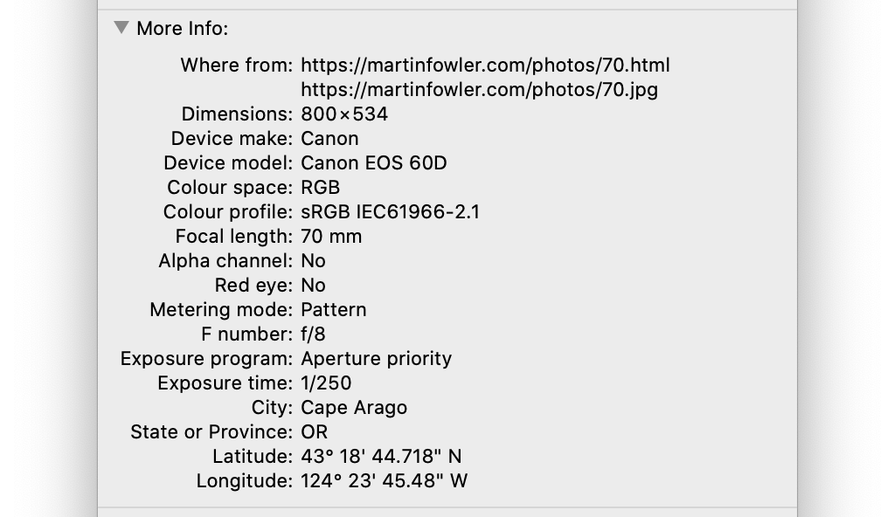
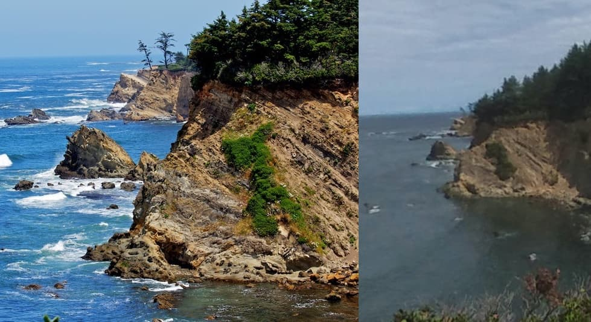

Metadata, or "data about data", is a useful thing to have.

On the web, it's great to have access to extra information about a webpage that browsers don't show through `<meta>` tags and response headers. When we're working with filesystems, we might care about when files were created and their access permissions just as much as we might care about their contents.

But at the same time, metadata can also be a cause for concern.

<!--more-->

### Unintentional exposure via image files

Last week I was reading an online blog where the author had uploaded several photos. While that's all well and good, the metadata on the photos gave away _the exact location of their home_. Whenever they took a photo, their phone stored their location in the JPEG file.

As an example, I'm going to use a photo from [another online blog](https://martinfowler.com/photos/70.html). With a downloaded copy of the photo, we can inspect its details locally.

There's a host of useful information here! The key part is that latitude and longitude at the bottom. Plug that into your navigation service of choice, and you can find exactly where the photo was taken.

Hello Cape Arago!

{}Image credit to [Martin Fowler](https://martinfowler.com/photos/70.html) (left) and [Tim Groce](https://goo.gl/maps/RxhWVhn4GBW9qGf38) (right){}

This is great if you're a photographer looking to share nature photos, but not so great if you're taking selfies with your phone at a private residence.

### Disabling this behaviour

I won't deny that functionality like this has benefits for us as end users. With location-tagged photos, you can easily do things like mapping out your holiday travels with daily photos. In other situations though, sharing this data isn't desirable.

Aside from directly editing each photo, you can find guides on disabling location tracking for both [iOS](https://support.apple.com/en-us/HT207092) and [Android](https://support.google.com/photos/answer/6153599) online. The kicker is that these settings are often opt-out by design, and it can be hard to tell whether they're in effect.

It does bear mentioning that this concern is mainly relevant when working with _raw image files_. If you're uploading a photo to social media, most metadata will (hopefully!) be dropped by the provider as your uploads are processed. If you're exporting photos from your phone's archive though, care becomes necessary.

Privacy is hard, especially when the situation is nuanced. Metadata like this can be sensitive, but sometimes it's a necessary or beneficial part of operations. What some users find worrying may hardly concern others.

Metadata, by its nature, lurks beneath the surface. Even it's out of sight though, it shouldn't be out of mind.
