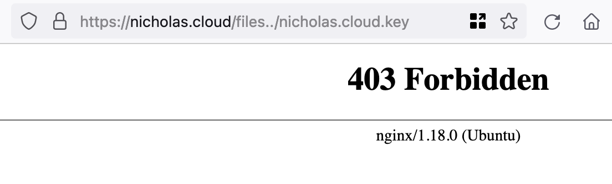

When Nginx is serving this website, it's usually serving static files from the local machine. One method to accomplish this is with the `alias` directive, which substitutes the request location for a filepath. I use it to map requests to `nicholas.cloud/files/` to a directory for public file-sharing.

<!--more-->

One catch with this setup is that you'll get a 404 if you visit `nicholas.cloud/files`, as it lacks a trailing slash. Users often overlook and forget this slash, so many websites these days choose to deal with it internally and show the right page.

If this trailing slash is such an encumbrance, why not drop it from my own config? This way, if someone goes to `nicholas.cloud/files`, they'll end up on the right path.

I figured it would be nice to have, so I made a small change to my Nginx config.

```diff
      # FILES
-     location /files/ {
+     location /files {
          alias /home/nicholas/public-files/;
          add_header "Cache-Control" "public, max-age=0, s-maxage=60";
      }
```

One reload later, and requests missing the trailing slash were successfully redirected! But while this change was convenient, I felt concerned at the time that it was a tad unsafe. I decided to experiment.

Poor path matching logic is a common (and lucrative) vulnerability for webservers like this. If an attacker can access parent directories above the target folder, all manner of sensitive files on the host can be exposed.

As it turns out, my change created exactly this opening.



Lo and behold, Nginx was now trying to serve the TLS private key that sits in the root of my user directory. There's two things to note here.

-   It is not wise for these senstive files to be sitting in a such an exposed location.
-   I'm _really_ glad I [set the file's permissions to be private](https://github.com/nchlswhttkr/website/blob/d9220ae4d58eb87693a14fdb6038db015b5a75d1/droplet-config/ansible/manage-server.yml#L421) now.

At that moment, any path starting with `/files` would follow the `alias` directive. Nginx was accessing `/home/nicholas/public-files/../nicholas.cloud.key`, and finding my key.

Thankfully, the fix this time was only a quick revert away. If only it was always that easy. :sweat:

Next time, I think I'll stick to writing a workaround rule rather than making such a reckless change. :sweat_smile:

---

As a point of reflection, it's worth noting that the [Nginx documentation for `alias`](https://nginx.org/en/docs/http/ngx_http_core_module.html#alias) specifically uses the term "replacement".

> Defines a replacement for the specified location.

If that isn't a big caution sign, I don't know what is!
