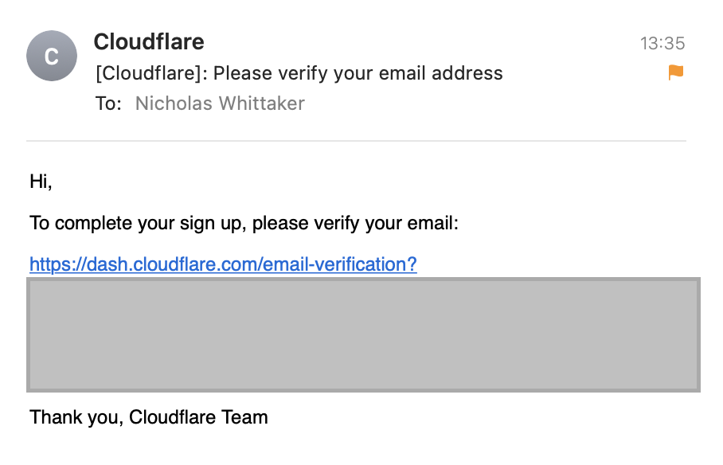

I received an email from Cloudflare today about an account that had been created with my email address. Going by the details and the headers, it certainly seemed to have originated from Cloudflare. It looked like someone else had signed up with my details.

<!--more-->

Now, it's worth noting that I do already use Cloudflare to manage this website. The email address I use for that account is hosted separately though, otherwise I'm one DNS mistake away from making my inbox unreachable!

A bit of investigating online later, and it looks like this certainly is malicious behaviour.

Going by [this Twitter thread](https://twitter.com/andrewfergusson/status/1440617619845877771), it seems unverified accounts are able to provision API credentials. Unlike an authenticated browser session, these credentials persist _even when_ you reset an account's password.

If a target went through the reset flow to gain control of the account created in their name, the attacker would still have near-complete account access with existing API credentials. These would continue to persist until deleted from the account.

I'm not sure why an attacker would target me, but I assume they just got my email as part of a list. Fortunately, it's straightforward to reset the account's password (_without_ verifying the email address) and request [the account be deleted](https://developers.cloudflare.com/fundamentals/account-and-billing/account-maintenance/delete-account/).
