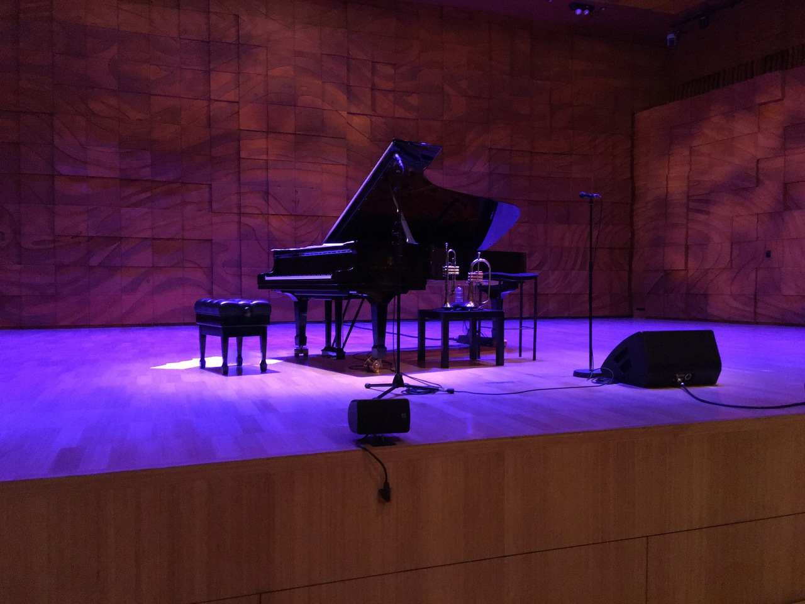

I'm excited to report that live music has returned to Melbourne, and I couldn't be happier. After a year of online performances of _mixed_ quality, it's amazing that I can go to physical concerts once more.

<!--more-->

I cross Princes Bridge and a busking saxaphonist is belting out Vulfpeck lines. I walk past a queue leading into Hamer Hall, and another busker is playing a vibraphone. University students walk past me, instrument cases in hand.

I'm going to the Melbourne Recital Centre to see pianist Luke Howard and trumpeter Nadje Noordhuis give the first live performance of their 2015 album, _Ten Sails_. I complete the check in form, show my ticket, and head to my designated seat.

Of course, with the return of concerts comes the return of all the small annoyances of being in the audience. The gentleman beside me clears his throat every thirty seconds. The stage left speaker is rattling. Someone forgot to turn their flash off. Perhaps that's what gives a setting like this its character?

Music hasn't just returned in our recital centres and concert halls either. If you were around Federation Square, you may have seen the live opera performance - I only found out when I ran into a friend on my way back to Flinders Street station!

In true Melbourne fashion, it seems like replacement buses are also back in full swing. At least I have music to listen to while I ride public transport.


