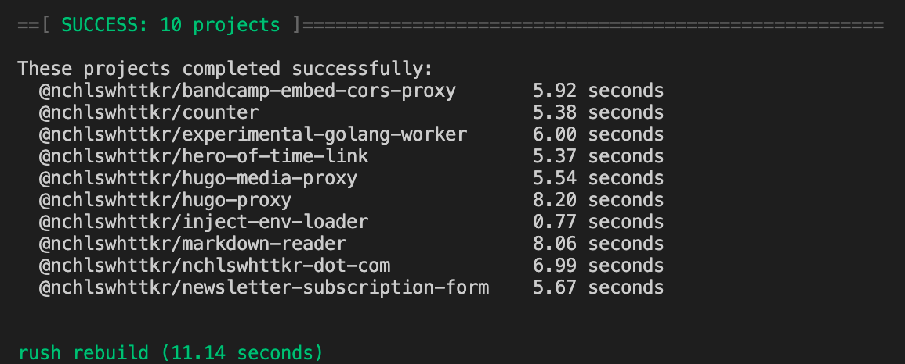

For a while now, I've used [Rush](https://rushjs.io/) to manage and deploy a number of Cloudflare Workers from a monorepo. It's been great for me so far, offering incremental builds and support for alternative package managers like PNPM.

One thing Rush leaves to the discretion of maintainers is secrets management. Given tooling and infrastructure can vary drastically between organisations and _even individual projects_, there's nothing wrong with this decision. However, it has lead to me implementing my own less-than-desirable setup.

<!--more-->

-   Every project follows its own `build.sh` script to load secrets, build and deploy
-   Cloudflare-related credentials are read from a shared script
-   Workers that need third-party API tokens read them from their own `.env` file

This _works_, but it has a number of shortcomings. What if a worker needs to be deployed to a different Cloudflare zone (website) from every other worker? How do I manage/keep track of all these `.env` files?

I ended up looking to the [`pass` password manager](https://www.passwordstore.org/). I've found it convenient for my personal projects, as it leverages my existing GPG setup and makes it easy to store/retrieve secrets from the command line.

A [few changes later](https://github.com/nchlswhttkr/workers/compare/00ef2524f8fd62ffe8e85d577a308fb6b530e63e...a23ab94f1220bfdf0940f38963366c93956f9b5e), and now the build scripts for each project are explicit about what secrets they need! Here's an abridged example.

```diff
- source ../../set-cloudflare-secrets.sh
+ export CF_ACCOUNT_ID=$(pass show workers/cloudflare-account-id)
+ export CF_API_TOKEN=$(pass show workers/cloudflare-api-token)
+ export CF_ZONE_ID=$(pass show workers/cloudflare-zone-id-nicholas.cloud)
- source .env
+ export MAILGUN_API_KEY=$(pass show workers/newsletter-subscription-form/mailgun-api-key)
+ export EMAIL_SIGNING_SECRET=$(pass show workers/newsletter-subscription-form/email-signing-secret)
```

I did find an interesting interaction between Rush and the GPG agent. Rush attempts to build projects in parallel where possible, and if too many processes are decrypting secrets at once the GPG agent will return a `Cannot allocate memory` error.

Thankfully this can be fixed by adding the `--auto-expand-secmem` option to the agent's config. This allows gcrypt (used by GPG) to [allocate secure memory as needed](https://dev.gnupg.org/T4255#120848).

```cfg
# ~/.gnupg/gpg-agent.conf
auto-expand-secmem
```

With the GPG agent restarted, I can now build many projects with secrets in parallel! It's also good to have my secrets sitting safely outside source control, stored in a place where I can easily back them up.



Using `pass` to fetch and decrypt secrets does admittedly add a few seconds to each build. Thankfully, Rush's parallelism keeps the overall build comparatively fast. In my eyes, the tradeoff is worth it.
