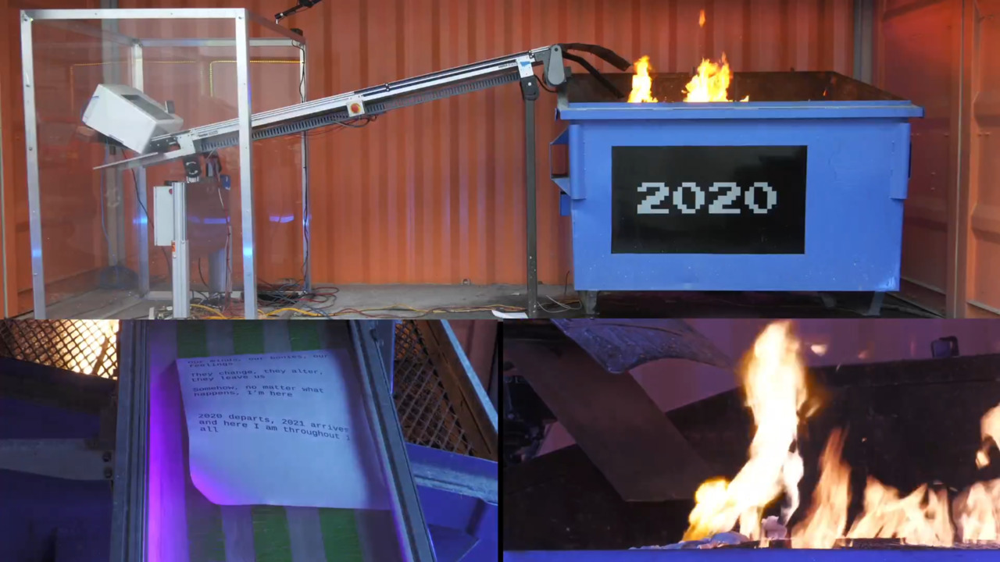

As a wrap to 2020, the team at Basecamp ran a campaign called [Dumpster Fire](https://dumpsterfile.email/). The premise was simple: Send an email, and watch a contraption print it and feed it into a fire. It was open to anyone, so I joined in to farewell the year as it passed.

<!--more-->

So how does one encapsulate the feelings of 2020? I chose a lyrics from [_The Rhythm Changes_ by Kamasi Washington](https://www.youtube.com/watch?v=tpF-qs3yP7Y), written and sung by Patrice Quinn. Along with my own snippet, of course.

> _Our minds, our bodies, our feelings_ \
> _They change, they alter, they leave us_ \
> _Somehow, no matter what happens, I’m here_
>
> _2020 departs, 2021 arrives, and here I am throughout it all_

Surprisingly sending the email itself took several attempts, as spam filters caught my personal email. I resorted to using my Google account to make sure it went through. A week later, I was greeted with a video of my email going up in flames.

Along with the livestream of my email burning, the team at Basecamp were kind enough to capture it in [a 30 second clip](https://hey.science/dumpster-fire/clip/?id=129107763). In a fitting turn of events, my printed email got stuck on the conveyor belt and avoided burning to a crisp.

You can also read about the making of this experiment on [the Basecamp blog](https://m.signalvnoise.com/the-making-of-a-dumpster-fire/).
