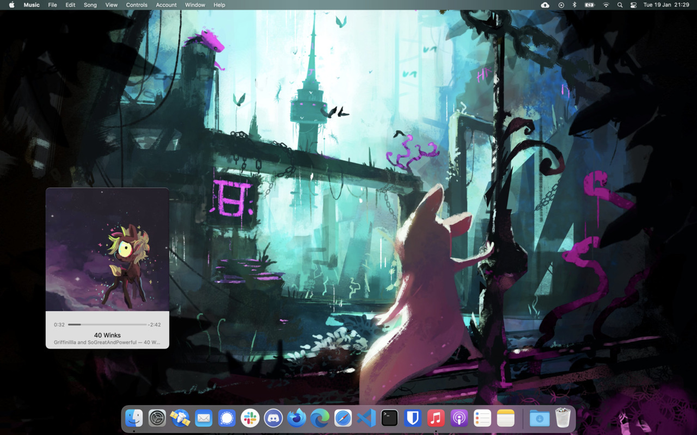

After recent issues with my laptop, I’ve had to take it in for repair. As an exercise in disaster recovery, I thought it would be good idea to treat the laptop as a write-off when handing it over.

<!--more-->

I’ll save the preparation and repair store stories for another day, but the key thing is that I’m starting from a clean slate with this laptop now. Physically, it’s identical to how it was before. I’m running macOS Big Sur now (previously Catalina) with a fresh hard drive.

Previously I called this laptop “Eupho”, in line with my practice of naming my devices after brass instruments. This is a new device in the body of an old one though, so what do I call it now? This time around, I’m going with “Phoenix”, the firebird that dies to be reborn anew.

Hello from Phoenix!

_My background is a piece of [Rain World artwork from Del Northern](https://miimows.artstation.com/projects/Y6mL3)!_

