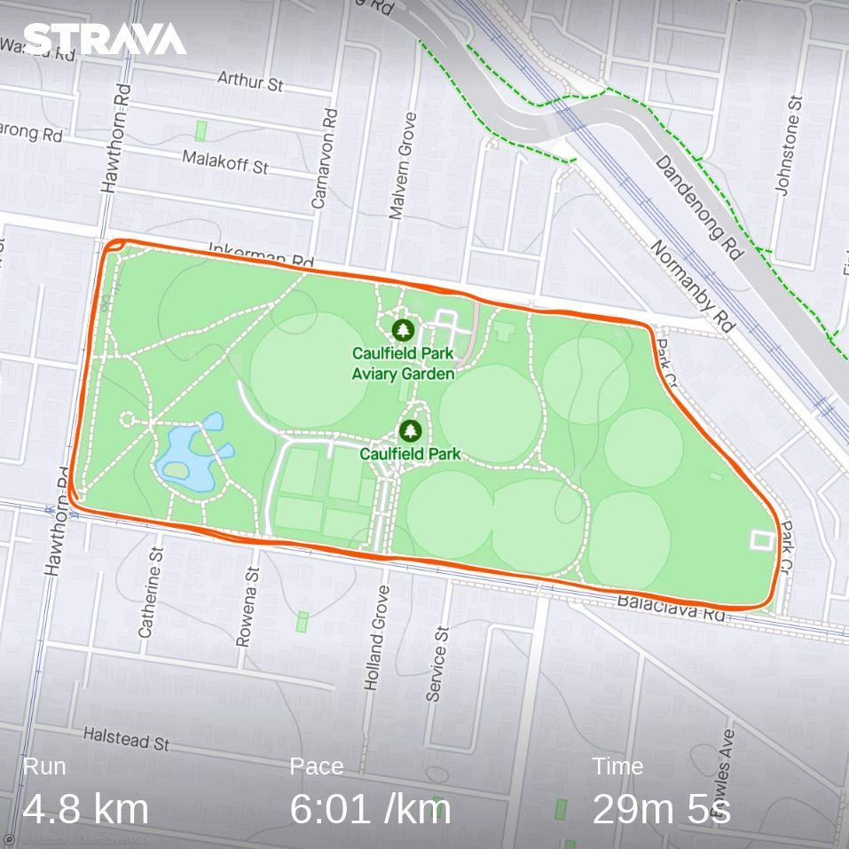

Since late September, I've been working to establish an exercise routine as I improve my fitness. One of my decisions in that journey has been to buy a smart watch, and having just ticked over six months since purchase I thought it would be an opportune time to reflect on some of my highlights.

<!--more-->

Seeing as I predominantly use Apple devices already and wanted to avoid any great deal of setup, I opted for an Apple Watch. They're still pricier than a nice Fitbit or Garmin watch, but with the recent release of the more afforable Apple Watch SE, I was happy taking the plunge. While it doesn't have all the features of the flagship watches, it has essentials for me like fall detection and a battery life that can easily last a full day out.

With the watch in hand and the sunk cost as a motivation to be active, I've been using it to record my workouts and my daily activity. All the data is synced across to my phone, visible in the Health app alongside a host of other derived and self-reported measures like resting heart rate and my weight. I try not to focus on the day-to-day numbers too much, but seeing where I'm trending is excellent motivation to continue my work.

Recording activities has also meant I can use Strava to share my activities with my friends, which in turns drives me to keep up my habits. I've paid for an annual membership, which has been useful for setting myself weekly goals and identifying how hard I've been pushing myself.

## Riding

Late last year I started riding my bike again, looking for more intense activity than just a brisk walk. I'm fortunate to live close to the bay trail along Melbourne's east coast, so I worked myself up travelling further and further along the coast until I could reach the CBD or go down to Mordialloc. Weekends have also been a good opportunity to go on longer rides!

With these more intense rides, it's been useful to see how much I'm exerting myself on my watch. I've actually switched over the default display I use for riding to one that shows my heart rate and Apple's approximation of my zones.

I'm working towards completing the 100km ride for [Around The Bay](https://bicyclenetwork.com.au/rides-and-events/around-the-bay/) in October as well, and the group training rides I've done so far have been good both for the exercise and the social coffee afterwards.

Riding at higher speeds and as part of a group is still quite daunting, but the folks at Bicycle Network organising the rides have been welcoming to newcomers like myself. It feels pretty awesome to go zooming along Beach Road bright and early on a Saturday!

## Running

Back in May, I went on a holiday to Phillip Island to compete in a lawn bowls tournament. I had hoped to borrow a bike in Cowes, but with the winter weather and no gear I was content wandering the town. The day after arriving though I had some slack time before dinner, so I decided to go for a run along the beach to close my rings for the day.

That first run was pretty unpleasant, and after a very overeager starting pace I was glad that I'd opted to walk after the first kilometre. The second leg of the run was also grueling, particularly with a couple of hills on the way back to my hotel room. I was glad to be done and collapsed into my bed when I got back. The parma for dinner that night was particularly satisfying.

Luckily my legs were feeling alright for the tournament the next day, although I couldn't handle the wind and was eliminated in the group stage.

On my last day in Cowes, I went for another run before checking out. Although it was also pretty tough, extending the distance to run a little further and see more along the coast made it more enjoyable.

Since then, I've tried to run at least twice a week. My route varies, but I've found a flat-ish 2.5km circuit around my local park where I can focus on balancing my pace against my exertion. My exercise group will sometimes do weekend runs, mixing distance with exercises like stair climbing.

I'm still yet to hit 5km, but most recently a double lap of Caulfield Park was a good progress check. Running with my friend helped me push myself, and being able to run twice the distance I did two months ago (with a 5 minute rest!) is a proud accomplishment for me.

As with cycling, it's been insightful to see the analysis my watch and Strava provide. Running is much more intense for me, so being able to see the changes measured and visualised is in itself rewarding. My recovery has improved, my heart rate climbs at a slower rate than before, and my pace over the same course each week has improved dramatically.

Seeing the slow trend up as I run more each week feels great too.

# Closing my rings

Lastly, being able to able to see a general measure of my acitivty visualised with the three rings Apple uses has itself been a good driver to keep myself active. Even if I'm having a day off, it feels satisfying to close my rings with a walk so I know I'm not spending the entire day inside sitting idle at my desk.

It's also pretty cool that I can scroll back through my activity and see six months of progress. I might have been sick from time to time, but at the end of the day I've built a strong habit since I got my watch.

