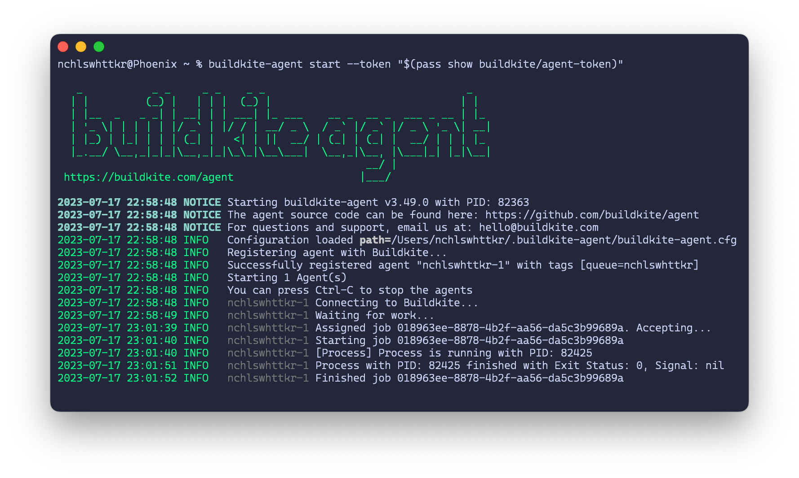

For a while now, I've built and published [my own Terraform provider](https://github.com/nchlswhttkr/terraform-provider-pass/) for retrieving secrets from [a pass store](https://passwordstore.org/). One of the requirements to publish a Terraform provider is that every release must be signed with a GPG key.

I have a Buildkite pipeline to build and publish these releases to GitHub. A step in this pipeline has access to a private key for signing, but it's a different key from the one I use on my own machine. I consider the latter too sensitive to expose freely to my Buildkite agents.

With that said, managing a second key _just_ to publish my Terraform provider is quite irksome when it has no other use for me. However, it's unfortunately necessary if I don't want to expose my regular key to my CI environment.

But if the worry is around exposing a secret to Buildkite agents running _outside_ my machine, why not introduce an agent that runs _specifically_ on my machine?

<!--more-->

Buildkite agents are commonly run on easy-to-reproduce hosts, such as virtual machines or containers in a cluster. They _can_ be run on any host with a supported OS/architecture though, which includes my daily driver MacBook. Running an agent locally is doable, but there are also good reasons why it _usually_ isn't suitable.

-   Developer environments tend be volatile, with tools and dependencies that might be missing or on an incompatible version
-   They tend to have poor availability, only being online so long as the agent is running and the machine is not shut down

Given I'll only be needing the agent infrequently when I'm making a release, and it only needs to sign the release on GitHub, these concerns are minimal. Time to get cracking!

With [the old build script cleaned up and a new step to handle the release signing](https://github.com/nchlswhttkr/terraform-provider-pass/commit/dd20738dfd522a1c19cc2278357fae6822769c9c), the only key change I need to make is to target the Buildkite agent running locally rather than using the default queue.

```diff
    - label: ":github: Sign and publish release"
      key: sign-release
      depends_on: create-release
      command: .buildkite/sign-release.sh
      if: build.env("BUILDKITE_TAG") =~ /^v\d/
+     agents:
+       queue: nchlswhttkr
```

When a build runs the brunt of the work is done on default agents, but the signing step targets the agent with matching tags that I'm running locally.


Locally, I can see the Buildkite agent running the job.



I'm prompted to unlock my GPG key by the pinentry program I wrote for myself.


Finally, the signed checksum is uploaded to the GitHub release. The new provider version can now be downloaded and used by Terraform!


With signing on the local agent working, I can do away with the second key I needed before. All of my releases can now be signed with my regular GPG key, and better yet without compromising on how I limit access to it!
