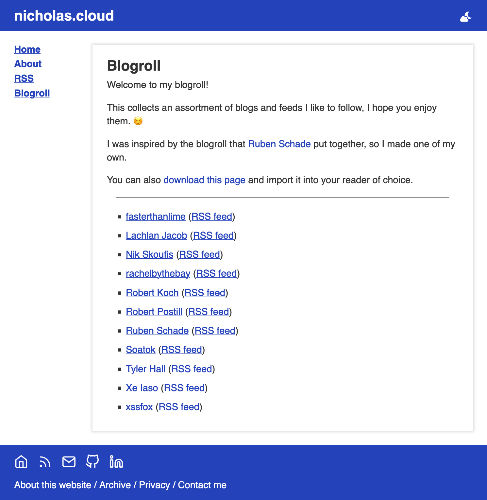

For a while, I've provided a list of suggested blog/feeds on my website in a blogroll.

This blogroll takes the form of an OPML file that RSS readers can import. It's pretty neat, but making it browser-friendly has always been on my wishlist.

So it was pretty cool to stumble across XSLT - a means for transforming XML documents.

<!--more-->

In this case, XSLT offers a means to transform the OPML blogroll into HTML that a browser can render and style. I got the inspiration from Ruben Schade and his guide on [styling OPML with XSLT](https://rubenerd.com/styling-opml-and-rss-with-xslt/), which he used on his own blogroll.

Applying this to my blogroll gave me the best of both worlds:

-   The blogroll resembles my website's regular HTML pages in a web browser
-   The file itself is still valid OPML which RSS readers can import

As an additional challenge, I wanted to continue generating the blogroll _dynamically_ in Hugo rather than hand-curating the XML. I've been doing this with a custom output format, listing feeds in the page's metadata.

```yml
---
title: "Blogroll"
outputs:
    - opml
params:
    feeds:
        - name: Lachlan Jacob
          xml: https://blog.etopiei.com/feed.php
          html: https://blog.etopiei.com/
```

Generating these OPML/XSLT documents dynamically came with another benefit, as I could avoid duplicating the base HTML template used for the rest of my website. There were a few roadbumps, but they were pretty negligible:

-   XML is stricter with self-closing elements, like `<hr>`
-   Common HTML entities like `&amp;` need to be defined explicitly or removed

Aside from that, the main challenge was bundling the XSLT into the existing document. Linking it from a static file is an option, but I wanted to include templating logic in the XSLT as well. Fortunately, XLST can be [embedded and referenced from within an existing OPML document](https://www.w3.org/TR/xslt20/#embedded).

```xml
<?xml version="1.0" encoding="utf-8"?>
<?xml-stylesheet type="text/xsl" href="#blogroll"?>

<opml version="2.0">

<head>
    <!-- OPML head -->
</head>
<body>
    <!-- OPML body -->
</body>

<xsl:stylesheet id="blogroll" version="2.0" xmlns:xsl="http://www.w3.org/1999/XSL/Transform">
    <!-- XSLT transformation -->
</xsl:stylesheet>

</opml>
```

With that addition my blogroll now renders in-browser, and looks like most pages of my website!



As a last step, I did also need to add an Nginx directive for browsers to treat the OPML file as a XML document.

```nginx
# Serve OPML files as XML to force in-browser viewing
location /blogroll.opml {
    default_type application/xml;
}
```

So if you're interested in reading or following other interesting feeds now, have a read of my [blogroll](/blogroll.opml)!
