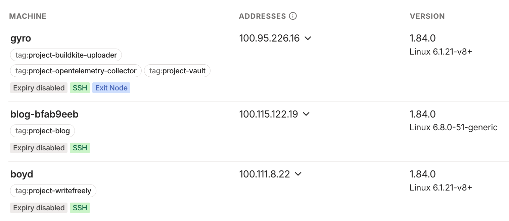

There's an oft-quoted phrase in the cloud/DevOps space.

> _Treat infrastructure as cattle, not pets._

To me, the advice is broad and emblematic for a lot of modern practices. Prefer disposable containers over long-lived hosts. Build infrastructure that scales horizontally to accomodate demand. Design architectures where components can be swapped out on the fly.

I thought I'd recap some recent changes to how I provision and manage this blog - addressing a few places where hostnames were hardcoded for convenience.

<!--more-->

This blog runs on a DigitalOcean droplet managed with Ansible. The inventory of hosts for Ansible to manage is generated from querying my Tailscale tailnet.

Previously, that inventory was a 1:1 mapping of machine names to hostnames. Hosts in an inventory can be grouped as well though. What if each Tailscale machine is tagged with the projects it hosts?



Mapping each of these tags to a group in the Ansible needs only [a small bit of wrangling with the inventory script](https://github.com/nchlswhttkr/hosting/blob/07cd9a23575b92abf3115a9020676390cf7fad32/deploy/inventory.py).

```json
{
    "project_buildkite_uploader": {
        "hosts": ["gyro.tailbf155.ts.net."]
    },
    "project_opentelemetry_collector": {
        "hosts": ["gyro.tailbf155.ts.net."]
    },
    "project_vault": {
        "hosts": ["gyro.tailbf155.ts.net."]
    },
    "project_blog": {
        "hosts": ["blog-bfab9eeb.tailbf155.ts.net."]
    },
    "project_writefreely": {
        "hosts": ["boyd.tailbf155.ts.net."]
    },
    "_meta": {}
}
```

Now I can swap out the hardcoded `blog` hostname, instead matching against _all_ hosts in the `project_blog` group.

```diff
  - name: Deploy Blog (https://nicholas.cloud/)
-   hosts: blog
+   hosts: project_blog
```

There's a few more benefits in addressing this reliance on static hostnames:

-   It's easier to support multiple hosts for a project
-   Adding/removing hosts is done by tagging, rather than code changes

There's a similar change to the build pipeline for my blog's content, which now gets [deployed to all tagged targets](https://github.com/nchlswhttkr/website/blob/1e41ea007f60ea95d2e08dcc6eb69a3bf98260d3/.buildkite/deploy.sh).

All in all, a nice little win for idle tinkering.
