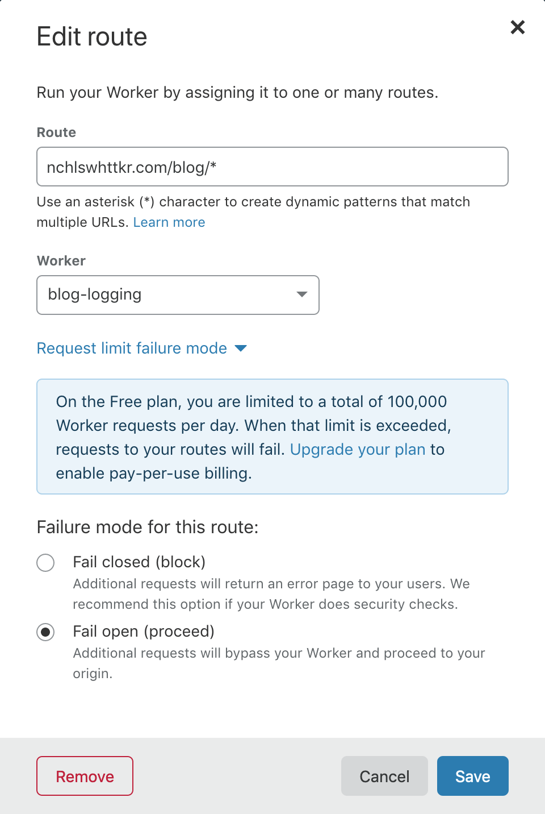
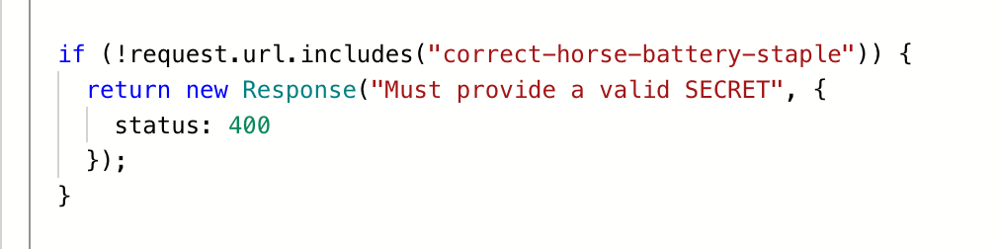

You may have heard of [Workers](https://workers.dev/), a product from Cloudflare that lets you run JavaScript/WebAssembly in a serverless fashion on Cloudflare's network.

I've been toying with them recently, and I thought it would be fun to share some of the uses I've come up with for them!

<!--more-->

If you haven't heard of [Cloudflare](https://cloudflare.com) before, I'd best describe them as a company that provides services geared towards improving the performance and security of internet traffic for their customers.

One of the first steps for a new customer is use Cloudflare as their domain's nameservers. This allows Cloudflare to act as a reverse proxy for internet traffic. That is, all traffic to a website goes through Cloudflare first. To cope with this traffic, Cloudflare has an [expansive, global network](https://cloudflare.com/network).

This arrangement also puts them in the prime position to offer serverless execution at the network edge.


{}Image credit to [Cloudflare](https://www.cloudflare.com/en-au/learning/serverless/serverless-javascript/){}

## What does serverless mean?

Explaining the ins-and-outs of the [serverless model](https://en.wikipedia.org/wiki/Serverless_computing) is a post in an of itself, but I'll try to cover the important bits here.

In contrast to applications running on self-hosted servers or virtual machines in the cloud, serverless applications are only spun up "on-demand" as requests come in. This makes them much faster and easier to scale, allowing them to "scale to zero" when there is no traffic. However, they can encounter significant latency problems when a new instance arises from a "cold start" or when an existing instance is resumed from idle.

Serverless architectures usually assume a stateless web layer. Memory may not persist after a response (for example, sessions). If information needs to persist, you should rely on an external store/database.

The application runtime is usually abstracted away to the provider. Instead of worrying about sysadmin work, you can focus on shipping code. In return, you sacrifice control over the runtime though. Typically, your deployment is only a blob of code that accepts a request and returns a response, along with any accompanying configuration.

## How do Workers operate?

I think the ["How It Works"](https://developers.cloudflare.com/workers/about/how-it-works/) page does a great job of summarising, but for the sake of brevity there are few key points to focus on.

-   The machines of Cloudlfare's network host an instance of the Workers runtime, which uses [Google's V8 engine](https://v8.dev).
-   Instead of using containers, a script executes in its own V8 _Isolate_, akin to sandboxed memory.
    -   A single Workers runtime can have many isolates (up to thousands!) running at any time.
-   This architecture has benefits in terms of performance, but the stateless principles of serverless still apply.

The script for a worker has some fairly light boilerplate, where an event listener is created to respond to incoming requests.

```js
addEventListener("fetch", (event) => {
    event.respondWith(handleRequest(event.request));
});

/**
 * Respond to the request
 * @param {Request} request
 */
async function handleRequest(request) {
    return new Response("hello world", { status: 200 });
}
```

Once you've published the code for a worker, you can set it up to receive traffic from configured routes on your website.

Without further ado, let's jump into some examples of Cloudflare Workers can do!

Presented in order of increasing insanity!

## Middleware

In Cloudflare's architecture, workers sit at the frontline to handle requests (aside from certain WAF-related page rules). This puts them in the ideal position to act as middleware for requests.

As requests come in to your domain, a worker can intercept them and do a number of things.

-   Reject a request for failing to meet requirements (lacking authorisation, insecure/outdated TLS, invalid format for your public-facing API).
-   Proxy/direct requests based on metadata/cookies (A/B testing, redirect international visitors to a localized version of your website).
-   Modify a response from your origin, such as changing headers for caching purposes.
-   Log/monitor traffic without client-side analytics

I think the last use case is very convenient. Say I wanted to record visits to my blog posts, gauging their popularity over time.

I could set up a worker to run on all `/blog/...` routes, logging pages as they're requested!

Here's a rough example.

```js
addEventListener("fetch", (event) => {
    event.passThroughOnException();
    event.respondWith(handleRequest(event));
});

const blogPostPath = /^\/blog\/([a-z0-9-]+)\/(index.html)?/;

async function handleRequest(event) {
    const matched = new URL(event.request.url).pathname.match(blogPostPath);
    if (matched !== null) {
        event.waitUntil(
            fetch("https://example.com/", {
                method: "POST",
                body: matched[1],
            })
        );
    }

    return fetch(event);
}
```



With my worker set up for all requests to `/blog/...` routes, and there's a few nice features here to note.

-   The "fail open" option ensures a response is still served from my origin, even if I exceed the free tier's daily limit of 100,000 requests.
-   Similarly, `FetchEvent.passThroughOnException()` means Cloudflare will fall back to my origin if the scripts throws an error at runtime.
-   The `FetchEvent.waitUntil()` method allows execution to continue serving a response.
    -   This means the response to a client isn't blocked waiting for logging to finish!

Seeing as Cloudflare already sits between your origin servers and your users, it seems fitting to host your middleware with them.

## Echoing requests to Slack

I've been doing a bit of work involving webhooks lately, so I though it would be useful to have a quick URL I can chuck in for debugging purposes.

Slack allows you to make apps for your own workspaces, so I made an "Echo" app for my private workspace. With an [incoming message webhook](https://api.slack.com/messaging/webhooks), the app can post to a nominated channel quickly and easily.

Let's go ahead and write up a worker to accept requests and echo the headers and body to Slack. I've stripped away the error-handling logic here to keep it concise.

```js
addEventListener("fetch", (event) => {
    event.respondWith(handleRequest(event.request));
});

async function handleRequest(request) {
    // Require a secret before posting to Slack
    if (!request.url.includes("hunter2")) {
        return new Response("Must provide a valid SECRET", { status: 400 });
    }

    // Grab content from the request
    const DATE = new Date().toISOString();
    const PATH = "/" + request.url.split("/")[4];
    const HEADERS = Array.from(request.headers.entries())
        .map(([key, value]) => `${key.padEnd(24, " ")}\t${value}`)
        .join("\n");
    const BODY = await request.text();

    // Format into a nice message for Slack
    const text = `
New request to \`${PATH}\` at \`${DATE}\`

Headers
\`\`\`
${HEADERS}
\`\`\`

Body
\`\`\`
${BODY}
\`\`\`
`;

    // Post to our #echo Slack channel
    await fetch("https://hooks.slack.com/...", {
        method: "POST",
        headers: {
            "Content-type": "application/json",
        },
        body: JSON.stringify({ text }),
    });

    return new Response("Accepted", { status: 201 });
}
```

There's just one problem here. How do we keep a secret value like the Slack webhook hidden? If it's made public, anyone will be able to post to my Slack channel!

Luckily, the [wrangler](https://github.com/cloudflare/wrangler) tool for publishing workers supports an optional build step. It can run [Webpack](https://webpack.js.org/) and publish the resulting output instead.

I took this as an opportunity to write a small [Babel](https://babeljs.io/) loader. It steps through my code, replacing matching identifiers with values from environment variables. So long as these variables were set at build time, they would be included in the published worker.

You can see the loader in action in this example. Locally, my code would resemble this.

```js
if (!request.url.includes(ENV_SECRET_KEY)) {
    return new Response("Must provide a valid SECRET", { status: 400 });
}
```

In the published worker though, `ENV_SECRET_KEY` gets replaced with a secret.



_Aside: Since I've started writing this post, Cloudflare have added the ability to [manage environment variables and secrets](https://blog.cloudflare.com/workers-secrets-environment/) through their CLI and dashboard. Although my workaround is redundant, I've left it in because it's an interesting solution._

With this configured as a part of the build step, my secrets were hidden from the public but visible to me!

## Getting cheeky with isolate persistence

Further reading on [the architecture behind Workers](https://developers.cloudflare.com/workers/about/how-it-works/) gleans these interesting snippets about the Isolate-based approach.

> A given isolate has its own scope, but isolates are not necessarily long-lived. An isolate may be spun down and evicted for a number of reasons.

> Because of this, it is generally advised that you not store mutable state in your global scope unless you have accounted for this contingency.

Given workers run by listening for requests, it's possible to have the handler function use variables from outside its scope.

While it isn't recommended practice, we can do it nonetheless! Let's look at a basic example.

```js
addEventListener("fetch", (event) => {
    event.respondWith(handleRequest(event.request));
});

let counter = 0;

async function handleRequest(request) {
    return new Response(`<h1>${++counter} request/s made!</h1>`, {
        status: 200,
        headers: {
            "Content-Type": "text/html",
        },
    });
}
```

This gives us an [incrementing counter](https://counter.nchlswhttkr.workers.dev/). Everytime a request is made the the worker, the counter is incremented.

So long as you hit the same edge node/isolate on each request and the isolate is not discarded, the counter will keep incrementing.

A more practical use for this could be to store responses from the web in memory, saving further roundtrips. However, the benefit in response time comes at the risk of a stale read — caution is required. It's worth noting that caching is available through [Cloudflare's CDN and Cache API](https://developers.cloudflare.com/workers/about/using-cache/).

## A verdict

I like Cloudflare Workers.

For existing customers, the ability to add a worker to routes on your domain is convenient. Their ability to "fail open" makes them flexible enough that I'd feel comfortable using them to extend an existing solution.

Alternatively, you can always publish workers to your dedicated `workers.dev` subdomain too. This gives a quick way to get a simple web application up and running without worrying about hosting/managing a server.

Something I didn't dig into is the ability to run WebAssembly in addition to JavaScript. This makes it feasible to use many more languages for your workers as well, so long as they support WASM as a compilation target!

Cloudflare have published a [number of templates](https://developers.cloudflare.com/workers/templates/) for various Workers if you'd like to see more examples of them in action!

I hope you've found this piece interesting. You can find most of the code from this post in my [repo of workers](https://github.com/nchlswhttkr/workers) on GitHub!
