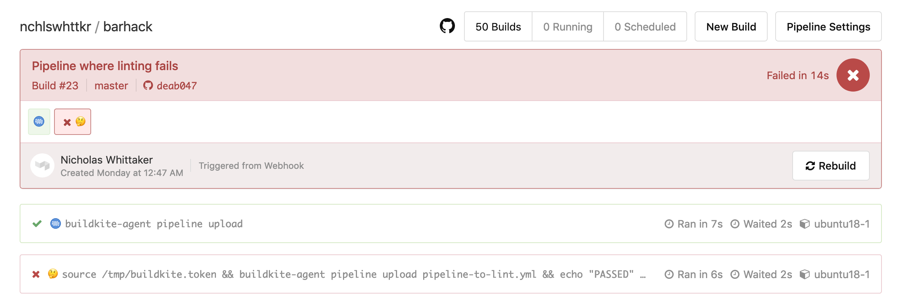
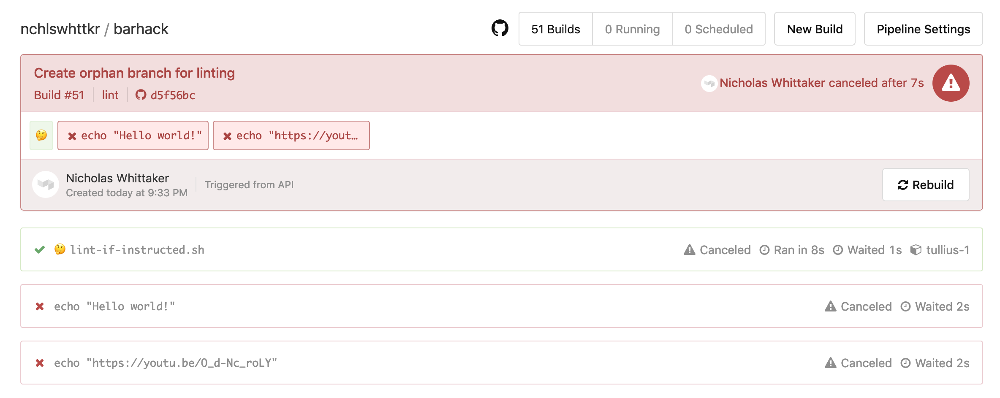

So I've been using [Buildkite](https://buildkite.com) a bit lately and enjoying it. I was struck by an idea



<!-- GITLAB CI LINT -->

So I started [cobbling a little something together](https://github.com/nchlswhttkr/barhack) while I was on my bar shift for my bowls club. Being the Sunday after the end-of-season party, the crowd was very light on and it afforded me the time dabble around and to build my solution.

### To start, some terminology

Buildkite can be used to run different automated processes.

These processes are called _pipelines_, and each pipeline is tied a Git repository. Typically it listens for webhooks from this repository, such as when a user pushes code or opens a pull request.

When this happens, a _build_ is started. Each build follows a series of steps, or _jobs_, which are defined in the settings for a pipeline.

Most jobs will have a single purpose. A job might check that code meets a style guide, or run tests, or deploy it to a production/staging environment.

With Buildkite each job is run by an _agent_, a process on a remote server. With a large number of agents many jobs can be run concurrently agent, with each agent running it's assigned job and reporting back to Buildkite.

During a build's runtime, further jobs can be added beyond the default steps of the pipeline. A common job is a [pipeline upload](https://buildkite.com/docs/agent/v3/cli-pipeline), where the agent searches for a set of steps in the source code of a repository, and adds them to the list of jobs for the current build. I usually call this the pipeline file.

As an example, here's a recent build for the pipeline I set up on my [personal website](https://source.nchlswhttkr.com).

1. The Buildkite agent looks for a pipeline file to upload, and finds `.buildkite/pipeline.yml` in the repository. \
   Upload this file creates two more jobs.
1. The first of these new jobs attempts to build my site using [Hugo](https://gohugo.io).
1. The second job builds (each job runs in a clean checkout of the repository) and deploys my website. \
   The chevron/arrow denotes that this job will only run after all previous jobs have succeeded. It won't run if the previous job fails.


There are further features to Buildkite, like requiring specific conditions for a job to run, but that's not what I'll be focusing on with this blog.

### Coming up with a rough design

The first step was deciding how to check a provided pipeline file to determine whether it was valid.

One option was to build a parser which could inspect [each step](https://buildkite.com/docs/pipelines/defining-steps) of the pipeline file for mistakes in syntax. The catch here would be in understanding the complete syntax of a pipeline, along with any edge cases that come with larger pipelines.

The other option was to attempt to upload the pipeline file within a running build. This would avoid any work in parsing the pipeline file, since all the work would be done by the Buildkite agent. Kicking off a build and running commands inside of it would take longer though, a tradeoff for not parsing the file myself.

I decided to go with the latter, since getting feedback about a pipeline's validity from Buildkite itself seemed the smarter choice.

### Proof of concept

To start, I set up a job in my pipeline that would try to upload a `pipeline-to-lint.yml` file. If uploading succeeded the job would then call the Buildkite API to cancel the current build, in order to prevent the newly-uploaded jobs from running and wasting resources. If the upload job failed, a [post-command hook](https://buildkite.com/docs/agent/v3/hooks) would catch that the upload had not succeeded and record a failure.

To persist this information beyond the lifetime of a build, I ended up just writing the status of a build to text file on the server. As a build starts, this status would be `PENDING`, and later turn to `PASSED` or `FAILED` after the build had run.

At this point it's worth noting that since jobs can be executed concurrently across multiple agents on different servers, you can't always be certain that the same server will always run your build. I tagged the agent on the server I wanted to use with `barhack=true` and used [agent targeting](https://buildkite.com/docs/agent/v3/cli-start#agent-targeting) to ensure that builds would always run on this server.


_<span class="center-text">Linting in this pipeline succeeds, and the rest of the build is cancelled.</span>_



_<span class="center-text">Linting in this pipeline fails, and no further jobs are run.</span>_

### We can do a bit better though!

At the moment, we need to run two full jobs before our file is linted. First, a job uploads the pipeline file that defines our linting step, and then another job is run our actual linting script.

<!-- Flexibility to validate a different file, not just the one we've committed. -->

However, if we include the linting script as a starting command for the pipeline itself, rather than specifying it in our `pipeline.yml` file, we skip the first job entirely! Running one less job also has the benefit of shaving our build time roughly in half!


This also fixes a subtle bugs that comes from running two jobs. After the first pipeline uploading job had finished, the `post-command` hook would run and mark the linting status as `FAILED`. Shortly after, the linting job would run and correct this if the `pipeline-to-lint.yml` was actually valid, but for a brief moment a passing file would show as failed.

### Making it more flexible

Right now, our linting job expects that the `pipeline-to-lint.yml` be checked in with the rest of source code. Needing to make a commit each time we want to run linting is a bit wasteful. It's time we take advantage of the fact that you can start a build from the Buildkite API, and not just from pushing commits!

When starting builds from Buildkite's API or web UI, you're also able to specify different environment variables that can overwrite the defaults for your pipeline. Lo and behold, we can now provide arguments that change with each build that runs our linting job.

So long as the pipeline file is accessible on the same server that our agent is running on, it should be able to lint it.

To kick off a pipeline to lint our file, a call to Buildkite instructs it to start a build. We included a `BARHACK_LINT_ID` environment variable to this build so it knows where to find the pipeline file to validate, and where to record the results.

```sh
curl -H "Authorization: Bearer $BUILDKITE_TOKEN" \
    -X POST "https://api.buildkite.com/v2/organizations/nchlswhttkr/pipelines/barhack/builds" \
    -d '{
        "commit": "HEAD",
        "branch": "lint",
        "env": {
            "BARHACK_LINT_ID": "5e33c2dc-3368-462e-9ff9-b1e6b1380487"
        }
    }'
```

### Exposing it to the web

Now that we can lint a provided file and save the result, it's time to make our own application over the top. This will make it easier to orchestrate the full process

- A client uploads their `pipeline.yml` file
- This file is saved, and a build is initiated to lint it
- A client can check the status of their file linting.

I chucked together a quick server with [hapi](https://hapi.dev) to accept a file upload, kick off the build, and to show the linting status for each pipeline file uploaded. Thankfully, Nginx's support for [Basic authentication](https://docs.nginx.com/nginx/admin-guide/security-controls/configuring-http-basic-authentication/) made it easy to limit access to this API.


_<span class="center-text">Here we upload a pipeline with two steps to be linted.</span>_

Looking within Buildkite, we can see that a build was kicked off, and it was cancelled when the pipline upload succeeded.



Checking the status in our API also shows that linting passed!

```sh
curl -H "Authorization: Basic <my-auth-details>" "https://barhack.nchlswhttkr.com/lint/5e33c2dc-3368-462e-9ff9-b1e6b1380487"
# {"status": "PASSED"}
```

So there we go, we've now got a service that lints our Buildkite pipeline files!

---

Could we go further?

We could try pinging the Buildkite API with a pipeline update ourselves, but this would involve parsing the `pipeline.yml` file, which I think negates the purpose of this exercise.

#### Interesting finds

You cannot set `key`s for the initial steps of your pipeline.

<!-- complex branch condition rules https://buildkite.com/nchlswhttkr/nchlswhttkr-dot-com/builds/39#0b9f1d67-d909-4c35-bd75-6e0e7a942246 -->

<!-- Final setup, loading secrets via hooks -->

<!-- agent targeting -->

<!-- TODO ADD IMAGE DESCRIPTIONS/CAPTIONS -->

<!-- TODO STAY CONSISTENT WITH PERSPECTIVE (YOU / WE / I / THE) -->
