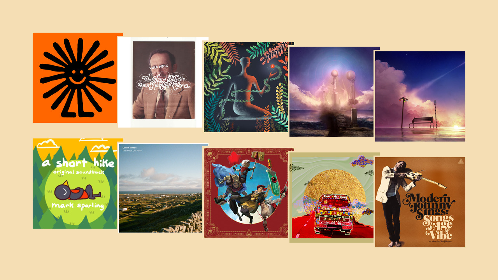

For me, 2020 was a very quiet year. I spent a lot of time at home, and wasn't out much aside from when I needed to be out. During that time, I found myself drawn to music listening as an escape.

As a way to farewell the year, I thought I'd highlight some of my favourite albums that have come out in the past twelve months.

You can find links to each album on Bandcamp for easy purchase and streaming. Most of these artists are also on Spotify, Apple Music and YouTube if any of those are your preferred choice.

So now in no particular order, here are my favourite music albums from 2020!

<!--more-->

## Strange Satisfaction - Woody & Jeremy

At the end of 2019, I celebrated by taking the plunge and buying the complete Vulfpeck discography after watching their [Madison Square Garden concert](https://www.youtube.com/watch?v=rv4wf7bzfFE) online. When I heard my favourite member, Woody Goss, was doing an album with a friend of his, I was all ears!

The album itself is absolutely funky in my book, and it all just feels remarkably _human_. Perhaps that's to the credit of Jeremy's singing. This album was there for me in a particularly rough time of the year, and it feels like good closure to give mention to it here.

An interesting discovery I stumbled upon was that the digital download for this album includes an eight track! Whether that a little treat or a mistake in publishing I'm not sure, but I enjoy the bonus nonetheless.

{}

## The Joy of Music, The Job of Real Estate - Vulfpeck

Vulfpeck also released an album as a band in 2020. Some songs in the release have been available online for years, but it's nice for me to have them collected into a proper album.

The most interesting tidbit with this album is that the final track was auctioned off to the highest bidder, with the proceeds going to charity.

{}

## Don't Shy Away - LOMA

Sometimes, I like to sit by the home page of Bandcamp to watch the live stream of purchases. Don't Shy Away was one of the albums I saw flash by one day, and decided to give it a go.

I find it calming to put this on from time to time. I'm hoping to see more music from LOMA in coming years, but first I also need to try their earlier music. I'll get to it in due time.

{}

## Realign - Red Vox

One of my completely new discoveries this year was the band Red Vox. Rock isn't always my genre, but I enjoy the band's sound and I've been happy keeping the album on loop since buying it.

This is also the first album I've bought on vinyl, and I'm looking for working my way back through Red Vox's discography in the near future.

{}

## Lost For A While - Red Vox

Realign also had a follow-up album incorporating a collection of songs that didn't make it onto the initial release. Seeing as this album also came out in 2020, it's fair game to include here!

{}

## A Short Hike - Mark Sparling

I bought the game _A Short Hike_ as part of a bundle around the middle of the year, and thoroughly enjoyed playing it. Its soothing soundtrack is rife with the acoustic sounds of guitars, piano and percussion, and is a fitting accompaniment for protagonist Claire's adventure.

This release includes both full-length and abridged versions of various pieces, since many pieces are designed to be blended to weave in with gameplay.

Now _technically_ this album was released in 2019, but I'm allowing it since additional tracks were added with an expansion that released a few months ago. Hooray for technicalities!

{}

## That Place, Our Place - Callum Mintzis

Another quiet album I loved was this collection of pieces for keys and strings. I think it's nice to have something softer in contrast to some of the more upbeat and energetic music I listen to.

This is the only album I've mentioned here that's from an Australian artist. I'm endavouring to try and see more music performances in Melbourne this year, so hopefully I'll have more local artists to show off next time!

{}

## Songs of Supergiant Games - Darren Korb & Ashley Barrett

Celebrating a decade of game soundtracks with selection of reorchestrated songs are the music team at Supergiant Games.

I'll freely admit that I still need to play several of their games – I don't quite have the computer to run Pyre well, and Hades is still on my TODO list – the soundtracks all sit close to me in my music library.

One last thing that amuses me with these arrangements is that they're able to balance the sound of a full trombone section (of three) against only a couple of violins. This is a near-impossible task with an acoustic ensemble, but modern recording/mastering makes it pleasant to my ear.

{}

## Carry Me Home - KOKOROKO

While technically only a _single_ and not an _album_, I am a big fan of KOROKOKO's afrobeat sound. They've only got a few songs to their name, but I eagerly await more releases!

{}

## Modern Johnny Sings: Songs in the Age of Vibe - Theo Katzman

My last album is from another Vulfpeck member, if that suggests a pattern. Theo has a golden voice, with the lyricism to match.

{}
