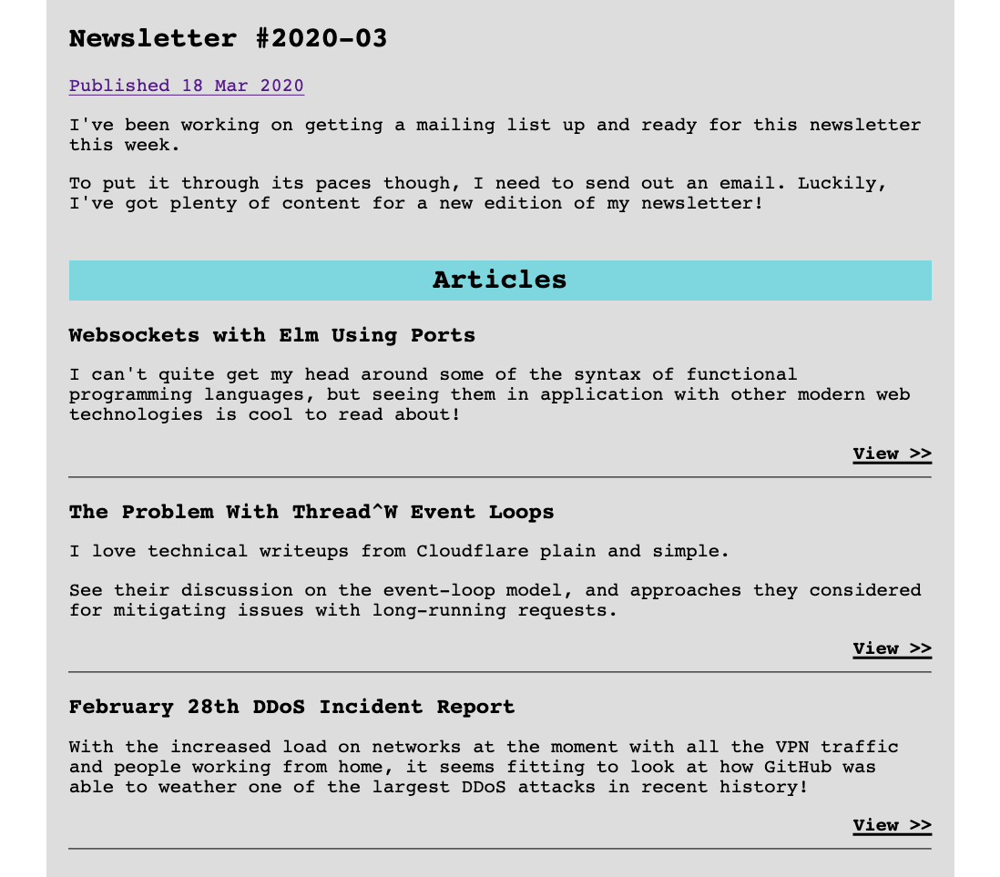
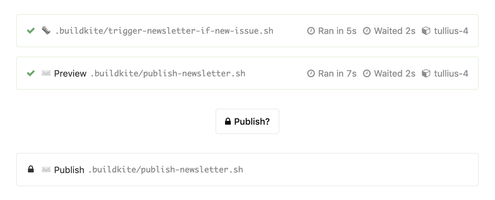

For the last while I've been collecting interesting articles, videos and music albums that I've liked into a [newsletter](/newsletter/). As a next step, I decided that I'd like to start emailing this newsletter out to a list of subscribers.

Going down the more challenging path that I always follow, I decided to roll my own system as a learning experience.

<!--more-->

I took inspiration for my newsletter's design from the [Microsoft.Source](https://azure.microsoft.com/en-us/resources/join-the-azure-developer-community/) newsletter from the Microsoft Azure team.

## Making a newsletter

Content for my newsletter is managed through [Hugo](https://gohugo.io) like the rest of my site. Hugo also provides nice utilities like `.Next` and `.Previous` links to aid readers navigating between newsletter issues.

There are a few caveats that come with sending emails as opposed to hosting web pages though.

-   CSS must be embedded within `<style/>` elements or inlined, as clients can ignore `<link/>` elements.
-   Emails must be entirely static (no JavaScript), though this isn't a concern here.
-   Absolute URLs must be used, as links with only a path (like `/blog/hello-world`) end up broken.

With the help of [Hugo shortcodes](https://gohugo.io/content-management/shortcodes/), I can write content for my newsletter while leaving styling/layout to the templating system.



Not the prettiest design, but it gets the job done now and I can improve it later!

## Sending emails with Mailgun

With a newsletter ready to send, I needed a mechanism to deliver emails.

I went with [Mailgun](https://mailgun.com), since they have predictable billing (US\$0.80 per 1000 emails) and several nice features to manage mailing list subscribers. There are a plethora of providers to choose from though, so always do your own investigating!

Here's the script that sends out my newsletter to all the subscribers of the `newsletter\@mailgun.nicholas.cloud` mailing list in Mailgun. This mailing list address only accepts messages by authenticated API calls, so I don't need to worry about it being hit with spam from the outside world.

```sh
curl --fail "https://nicholas.cloud/newsletter/2020-03/" > email.html
curl --fail "https://templates.mailchimp.com/services/html-to-text/" --data-urlencode html@email.html > email.text

curl --fail "https://api.eu.mailgun.net/v3/mailgun.nicholas.cloud/messages" \
    --user "api:$MAILGUN_API_KEY" \
    --data-urlencode to=newsletter@mailgun.nicholas.cloud \
    --data-urlencode "from=Nicholas <noreply@mailgun.nicholas.cloud>" \
    --data-urlencode "subject=Newsletter #2020-03 from nicholas.cloud" \
    --data-urlencode html@email.html \
    --data-urlencode text@email.text
```

To improve the delivery of emails, it's important to include a plaintext counterpart for the HTML content of the email. Conveniently, the folks at Mailchimp have a [tool to generate this email text](https://templates.mailchimp.com/resources/html-to-text/). Better yet, it can be `curl`ed!

Once the messages have been accepted by Mailgun, I can sit back and wait for them to be delivered! Mailgun manages the sending here, and even adds an unsubscribe link for me through their templating system!

## Automating releases with Buildkite

With an existing pipeline in [Buildkite](https://buildkite.com) for my website, adding a publishing step for a newsletter seemed reasonable.

I added a new step after deploying that would check for new newsletter issues (thanks `git diff-tree`!), and add the necesarry email-sending steps to the in-progress build!

Buildkite supports dynamic pipelines, so adding these steps while the build is already running is no worry at all!



With the aid of a block step I can send a preview email to myself first, and only send it on to my subscribers once I've unblocked it in Buildkite!

## Managing subscribers

Lastly, while I might have a pipeline to send my newsletters out, I'm still without subscribers to send to! A little bit more than a plain form to grab emails is needed here though.

I made a [Cloudflare Worker](https://workers.dev) for this, since I wanted to deploy a small-ish application a particular route on my website (being `/newsletter/subscribe/...`).

After a new reader supplies their email to a (very) basic form, I send an email to confirm the subscription. This double opt-in approach helps ensure all my subscribers are genuine, but it introduces additional complexity into the subscription process. How do you make sure the confirmation is genuine?

My solution was to send pending subscribers a confirmation link that included a signed representation of their email. That way, a subscription can only be confirmed with this signature, and until then I won't send the subscriber any contact. The [WebCrypto API](https://developer.mozilla.org/en-US/docs/Web/API/SubtleCrypto) available to workers made this a breeze to implement.

With the processes in place to publish and deliver newsletters, all my subscribers need to do is to sign up and wait to hear from me!

## Wrapping up

I hope you've enjoyed reading about how I set up my newsletter mailing list!

There's still further work for me to do on this arrangement, but it's mostly styling and minor content changes for now — everyone needs a privacy policy after all!

You're more than welcome to check out [my newsletter](/newsletter/), and if you'd like to subscribe you can to receive it in your email inbox too!

If you're interested in seeing all the code powering this, you can check out the repo of [my website](https://nicholas.cloud/goto/source) and [the worker](https://github.com/nchlswhttkr/workers#newsletter-subscription-form) for accepting subscriptions!
